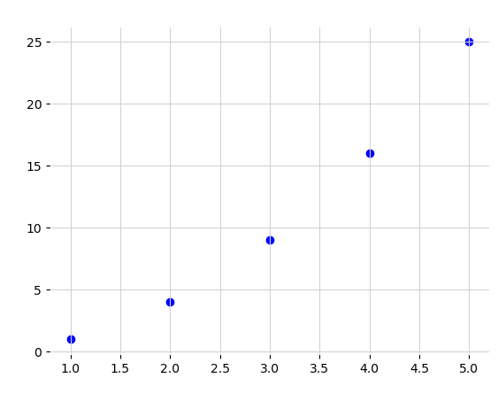
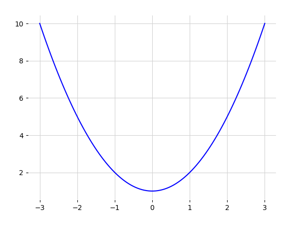
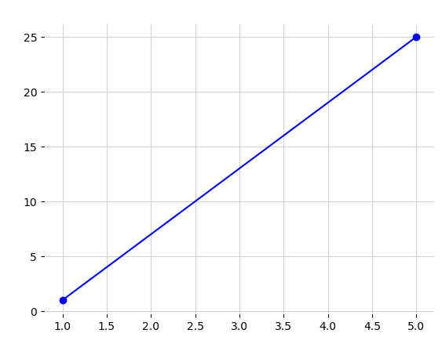
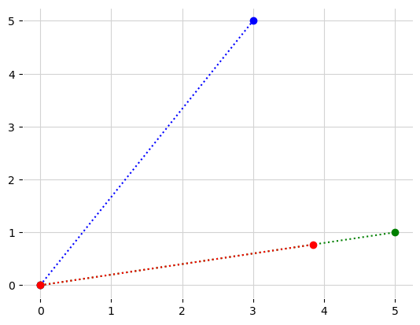
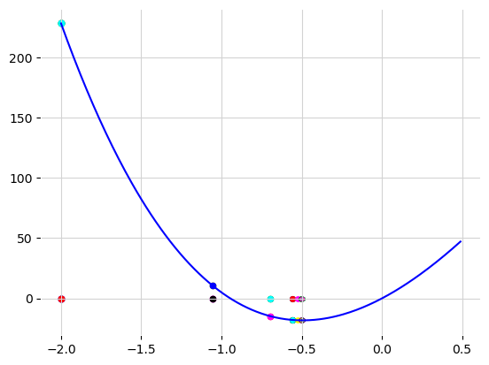
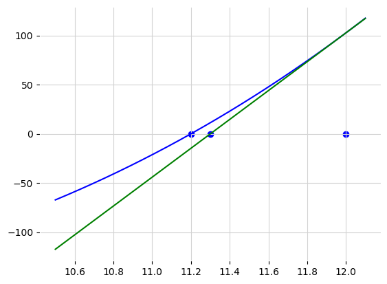
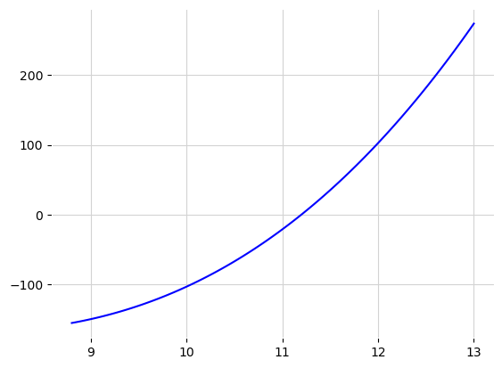

<!-- <a href="https://colab.research.google.com/github/mgrabul/optimization_methods/blob/main/optimizationmethods.ipynb" target="_parent"></a> -->

\tableofcontents

\newpage
# Python Introduction

Python is a general-purpose high-level programming language. It was invented in the late '80s, and its current major version is 3. Important features and characteristics of Python include:

* Object-oriented
* Dynamically typed
* Open source
* High-level
* Interpreted
* First-class functions
* Higher-order functions

Python code is interpreted, meaning it is transformed into byte code one line at a time during execution. There is no separate compile phase, so no compile time is needed. Popular uses of Python include scripting and automation, microservices, statistics, and machine learning.

Due to its open-source nature and well-developed libraries for computation and visualization, such as NumPy and Matplotlib, Python has become quite popular in math-related fields, especially in universities and academia. It has increasingly replaced previously well-established software like "Wolfram Mathematica" and "MATLAB."

\newpage
## Basic Python commands

Traditionally, every tutorial for a programming language starts with an introduction on how to display output to the screen or use the print command.
Printing is done with the function `print`.

**Example**: Print "Hello, World!"


```python
# Print a string
print("Hello World")
```

    Hello World


While printing, strings and numbers can be concatenated using the , sign.

**Example**. Concatenate the words "Hello" and "World" and print them.


```python
# Concatenating and printing strings
print("Concatenating Hello and World with +: "+"Hello"+" World")
print("Concatenating Hello and World with +: ","Hello"," World")
```

    Concatenating Hello and World with +: Hello World
    Concatenating Hello and World with +:  Hello  World


## Declaring variables in Python


Python is a dynamic language, and memory is assigned at execution time. This means that variables don't need to be associated with a type at the time of declaration; they receive their type at the time of initialization. As a result, only initialization is required. Additionally, because Python is dynamic, different types of data can be assigned to the same variable, although this is generally not considered good practice.

In Python, the symbol `:` can be used to provide hints on the variable type. These hints are used by development environments to provide information to the developer. Using type hints improves code quality and makes the coding process easier.


**Example**. Assign 1 and 2 to integer variables `x`, `y` and print their values


```python
x = 1
# int is a hint and not required in the following expression
y:int = 2

print("x is:")
print(x)
print("y is:")
print(y)

```

    x is:
    1
    y is:
    2


Almost anything can be printed using concatenation, but Python offers a more elegant way of formatting. Simple formatting is done by using the letter `f` before the string. Instead of concatenating, variables can be inserted directly into the string using `{}`.

**Example**: Using string formatting to print `x=1, y=2` where `x` and `y` are integer variables.


```python
x = 1
# int is a hint and not required in the following expression
y:int = 2

print(f"x={x}, y={y}")
```

    x=1, y=2


Similarly, a string can be formatted into two lines using `"\n"` as a line break.


**Example**. Print one string in two lines using the `"\n"` line brake.


```python
print(f"To print in a new line use \\n \\n The following text will be printed in a new line:\\n'text in a new line'")
```

    To print in a new line use \n \n The following text will be printed in a new line:\n'text in a new line'


## Basic data types in Python


* Text Type:  str
* Numeric Types:  int, float, complex
* Sequence Types: list, tuple, range
* Mapping Type: dict
* Set Types:  set, frozenset
* Boolean Type: bool
* Binary Types: bytes, bytearray, memoryview
* None Type:  NoneType


**Example**. Declare the most common data types in Python.


```python
# Strings, datatypes that hold text.
x1: str = "Hello World"

# Integers, positive and negative whole numbers.
x2: int = 20

# Floats, datatypes that are generally used to represent real numbers.
# Mathematically speaking, they are real numbers with a precision of usually 16-17 digits.
x3: float = 20.5

# Complex numbers, used to represent numbers with a real and an imaginary part.
# They have precision similar to floats.
x4: complex = 1j

# List or array, collections of indexed elements. The elements don't have to be unique.
x5: list = ["apple", "banana", "cherry"]
# The indexing starts from 0. e.g., access the second element of a list
x5_2 = x5[1]

# Tuple, collections of indexed elements similar to lists but are immutable once
# created. This type of variable is not used in this book. It is used to
# represent static data that is stored in memory.
x6: tuple = ("apple", "banana", "cherry")

# Range, immutable sequences of numbers, usually used for looping or iterating
# in arrays or other data structures.
x7: range = range(6)

# Dictionary, key-value pair data structure where keys are unique. Usually used
# when building JSON objects or storing data. This variable is not used in this
# book.
x8: dict = {"name": "John", "age": 36}

# Access an element in the dictionary
x8_name = x8["name"]

# Set, unordered collections of unique elements. Not used in this book. Usually
# used to store or keep track of unique values.
x9: set = {"apple", "banana", "cherry"}

# Frozenset, unordered collections of unique elements. Unlike sets, they are
# immutable. Not used in this book. Could be used to store certain static
# parameters inside a client application or server from initialization until
# the end of the application.
x10: frozenset = frozenset({"apple", "banana", "cherry"})

# Boolean, represents True or False values. Mostly used for conditional statements.
x11: bool = True

# Bytes, sequences of bytes. Once a bytes object is created, its elements cannot
# be changed. Used when dealing with communication with embedded devices like
# electronic cards. This variable is not of interest for the purposes/range of
# this book.
x12: bytes = b"Hello"

# Bytearray, similar to bytes but mutable, meaning elements can be changed.
# This variable is not of interest for the purposes/range of this book.
x13: bytearray = bytearray(5)

# None, used to represent the absence of a value.
x14: None = None
```

***When writing high-quality code, it is essential to select variable types that satisfy the minimal requirements for the use case. This seminar work has an educational purpose and balances efficient code practices with clarity. For this reason, not necessarily the most effective but the most common and recognizable data types are used.***

## Basic arithmetic operations in Python


Python provides several built-in operators for basic arithmetic operations. These are the most common ones:
* Addition (+): Adds two numbers together.
* Subtraction (-): Subtracts one number from another.
* Multiplication (*): Multiplies two numbers.
* Division (/): Divides one number by another (returns a float).
* Integer Division (//): Divides one number by another and returns the integer part of the result.
* Modulo (%), returns the remainder when one number is divided by another
* Exponentiation (**): Raises one number to the power of another.


**Example**. Demonstrate the usage the most common built-in operators in Python.


```python
# Addition
result = 5 + 3
print("Addition:", result)
# Subtraction
result = 5 - 3
print("Subtraction:", result)
# Multiplication
result = 5 * 3
print("Multiplication:", result)
# Division
result = 5 / 3
print("Division:", result)
# Integer Division
result = 5 // 3
print("Integer Division:", result)
# Modulo
result = 5 % 3
print("Modulo:", result)
# Exponentiation
result = 2 ** 3
print("Exponentiation:", result)
```

    Addition: 8
    Subtraction: 2
    Multiplication: 15
    Division: 1.6666666666666667
    Integer Division: 1
    Modulo: 2
    Exponentiation: 8


## If - else conditions in Python

The general form of an `if-else` condition in Python is:

```
if <bool>:
 <code block>
elif <bool>:
 <code block>
 .....
else:
 <code block>

```

As shown, python uses the symbol `:` followed by new line with indentation to indicate a start of a new block.


**Example**. Given a number `i`, print one of the following "`i` is smaller or equal to 10", "`i` is smaller than 20", "`i` is equal to 20", "`i` is bigger than 20" depending on `i`.


```python
i_:int = 12

if i_<=10:
  print("i is smaller or equal to 10")
elif i_<20:
 print("i is smaller than 20")
elif i==20:
 print("i is equal to 20")
else:
 print("i is bigger or equal than 20")
```

    i is smaller than 20


\newpage
## Loops and iterations in Python


As in other languages, commonly used loops in Python are `while` and `for` loops. Additionally, Python supports functional programming, and it is not uncommon for functions to be used instead of declarative loops for interactions, especially when working with data collections.

The while loop syntax form in python is the following:

```
while <boolean>:
    <code block>
```
**Example**. Using while loop print the elements of a list, `l = {1,2,3,"this is the last element of the list"}`


```python
l = [1,2,3,"this is the last element of the list"]

index_l = 0
while(index_l<4):
  print(l[index_l])
  index_l = index_l + 1
```

    1
    2
    3
    this is the last element of the list


The general form of a `for` loop in Python is:

```
for variable in sequence:
    <code block>
```    

**Example**. Using for loop, print the elements of the list `l = {1,2,3,"this is the last element of the list"}`


```python
l = [1,2,3,"this is the last element of the list"]

for element in l:
    print(element)
```

    1
    2
    3
    this is the last element of the list


Python supports functional programming, so it is becoming increasingly popular to use functions instead of loops for iterating over data structures. Built-in functions like `map` and `reduce` are used to apply a function to the elements of a collection, such as a list or set. This style of writing code is called declarative. In contrast, imperative programming uses loops like `while` or `for` to iterate over data structures. More detailed examples will be shown in the functions section of this seminar work.

\newpage

**Example**. Using the map function print the elements of a list `l = [1,2,3,"this is the last element of the list"]` in Python


```python
l = [1, 2, 3, "this is the last element of the list"]

list(map(lambda x: print(x), l))
```

    1
    2
    3
    this is the last element of the list


    [None, None, None, None]


\newpage

## Functions in python

Depending on how they are defined, there are generally two types of functions in Python: lambda functions and standard functions. Standard functions, or just functions, are traditional and quite flexible, but they require more code to be defined. Lambda functions, on the other hand, require less code but are not as flexible, as they are limited to single-line expressions.

This seminar work will not use lambda functions, as they can be completely replaced by standard functions. In general, lambda functions are used with predefined functions like `map` or `reduce` when iterating over data structures. They are often inlined with these functions, which also contributes to code readability.

Standard function
```
def function_name(parameters):
   <Code block>
    <Command 1>
    <Command 2>
   ...
   </Code block>
   <!-- optional return -->
   return <value>
```

Lambda function
```
lambda parameters: expression
```

**Example**. Using a standard and a lambda function calculate the sum of two numbers and print the output.


```python
def sum_standard_function(x, y):
    result = x + y
    return result
# Call the standard function and print the output
sum_standard = sum_standard_function(3, 5)
print(f"Using Standard Function: {sum_standard}")

sum_lambda_function = lambda x, y: x + y
# Call the lambda function and print the output

sum_lambda = sum_lambda_function(3, 5)
print(f"Using Lambda Function: {sum_lambda}")
```

    Using Standard Function: 8
    Using Lambda Function: 8


**Functions are "first-class citizens" in Python**, meaning they are treated as variables. A function can be assigned to a variable, passed to another function as a parameter, or returned from a function. Treating functions as variables is part of the [functional programming paradigm](https://en.wikipedia.org/wiki/Functional_programming). These features are supported out of the box in Python, and as a result, higher-order functions can be created quite easily. In the following sections related to optimization, these Python features and other elements of the functional programming paradigm will be used extensively.

**Example**: Create a function that numerically calculates the derivative of a function $f(x)$ in $x$,

$f'(x) = \lim_{{\Delta x \to 0}} \frac{{f(x + \Delta x) - f(x)}}{\Delta x}$,

meaning instead of calculating the limit when $\Delta x$ approaching 0, use an extremely small interval $(x-\Delta x, x + \Delta x)$ around $x$ to approximate the derivative, where $\Delta x$ is very small ( e.g. $\Delta x =  10^{-5}$).


```python
def f(x_in:float):
  return x_in**2

def derivative_of(function_in):
  def numerical_derivative(x_in):
    _delta_x = 1e-5
    _derivate_f = (function_in(x_in + _delta_x) - function_in(x_in - _delta_x))/(2*_delta_x)
    return _derivate_f
  return numerical_derivative

derivative_f = derivative_of(f)

print(f"The approximation of the derivate of a function x^2 in x = 3 is {derivative_f(3)}")
```

    The approximation of the derivate of a function x^2 in x = 3 is 6.000000000039306


### Libraries and modules

Basic arithmetic operations with functions in Python include finding the absolute value using `abs` and calculating the square root using `math.sqrt`. The `abs` function is part of Python's standard library, while `sqrt` is part of the math library, which is commonly used but not included in the base library. Libraries are collections of modules, and modules are collections of functions and classes that are used for similar purposes. The math library needs to be imported before it is used. To do so, write `import math` before using it. Once imported, the functions and classes inside the library can be used by accessing them with dot notation. For example, `math.sqrt(9)` will return 3 as it calculates the square root of nine.

Modules, on the other hand, are files containing Python code within a library. For example, when using `import matplotlib.pyplot`, `pyplot` is a module in the `matplotlib` library that is used for plotting data. Modules and libraries can be imported with aliases instead of their full names. To define an alias for the module `matplotlib.pyplot`, the following code line can be used: `import matplotlib.pyplot as plt`.

*As with every programming language, the necessary libraries need to be imported and be part of the dependencies. The advantage of using Google Colab is that it handles the dependencies itself, so only an import statement for the required library is necessary.*
\newpage

**Example**: Given a number, calculate the square root of the absolute value of that number.


```python
import math

def calculate_sqrt_abs(num_in):
    abs_num = abs(num_in)
    sqrt_abs_num = math.sqrt(abs_num)
    return sqrt_abs_num

number = -9
result = calculate_sqrt_abs(number)
print(f"The square root of the absolute value of {number} is {result}")
```

    The square root of the absolute value of -9 is 3.0


## Logical Operators

Python uses `True` and `False` as boolean values.

The most popular logical operators are:
* `and`
* `or`
* `not`

Comparing values is done with:
* `<`, `<=`
* `>`, `>=`
* `==`

**Examples:**

1. Given two numbers `a` and `b`, write a function that will return the larger number.

2. Given three numbers `a`, `b`, and `c`, write a function that will return the largest number.

3. Given two numbers `a` and `b`, write a function that returns `True` if `a > b`.

4. Write a function that, given a number `n`, prints the first `n` numbers.


```python
# Example 1
def max_of_two(a, b):
    return a if a > b else b
print("Max of 10 and 20:", max_of_two(10, 20))  # Output: 20

# Example 2
def max_of_three(a, b, c):
    pom = a
    if(b>a):
      pom = b
    if(c>pom):
      pom = c
    return pom
print("Max of 50, 40, and 30:", max_of_three(50, 40, 30))  # Output: 50

# Example 3
def is_a_greater_than_b(a, b):
    return a > b
# Example 4
def print_first_n(n:int):
  print(f"First {n} positive integers:")
  i=1
  while(not is_a_greater_than_b(i,n)):
    print(i)
    i = i+1

print_first_n(10)
```

    Max of 10 and 20: 20
    Max of 50, 40, and 30: 50
    First 10 positive integers:
    1
    2
    3
    4
    5
    6
    7
    8
    9
    10


## Plotting Functions

One of the reasons why Python is popular in mathematical-related areas is because of the Matplotlib library. This library is used to draw or plot on a coordinate system. It can be used for drawing functions, dots, bars, histograms, and pie charts. It offers other useful options like drawing in different colors, naming the axes of the coordinate system, and naming the entire plot. It also supports drawing in both 2D and 3D.

**Examples:**

1. Draw dots in a coordinate system.

2. Draw a function in a coordinate system over a given domain.

3. Draw a line in a coordinate system that passes through two dots.


```python
# Optional, Customizing Matplotlib styles
# This step is not necessary and can be skipped, it makes sure that regardless of the system the plots will look the same.
import matplotlib.pyplot as plt
plt.rcParams['axes.prop_cycle'] = plt.cycler('color', ['blue', 'green', 'red', 'cyan', 'magenta', 'yellow', 'black'])
plt.rcParams['axes.facecolor'] = 'white'
plt.rcParams['figure.facecolor'] = 'white'
plt.rcParams['grid.color'] = 'lightgray'
plt.rcParams['xtick.color'] = 'black'
plt.rcParams['ytick.color'] = 'black'
```

\newpage


```python
import matplotlib.pyplot as plt
import numpy as np

# Example 1
# Draw dots

# Define coordinates for the dots
x_dots = [1, 2, 3, 4, 5]
y_dots = [1, 4, 9, 16, 25]

# Plot the dots
plt.scatter(x_dots, y_dots)
plt.xlabel('X')
plt.ylabel('Y')
plt.title('Dots in a Coordinate System')
plt.grid()
plt.show()

# Example 2
# Draw function

# Define the function
def f(x):
    return x**2 + 1

# Define the domain
x_func = np.linspace(-3, 3, 100)  # Adjust the domain as needed

# Plot the function
plt.plot(x_func, f(x_func))
plt.xlabel('X')
plt.ylabel('Y')
plt.title('Function in a Coordinate System')
plt.grid()
plt.show()

# Example 3
# Draw line

# Define the coordinates of the two dots
x_line = [1, 5]
y_line = [1, 25]

# Plot the line passing through the two dots
plt.plot(x_line, y_line, marker='o')
plt.xlabel('X')
plt.ylabel('Y')
plt.title('Line Passing Through Two Dots')
plt.grid()
plt.show()
```


    

    


    

    


    

    


\newpage

## Basic Mathematical Functions

**Absolute Value**

The absolute value using NumPy can be calculated with `np.abs(<np.array>)` or `abs(x)`. The `np.abs` function is used on a NumPy array and returns an array where all elements are positive.

**Polynomial Functions**

A one-dimensional polynomial function is defined as:
$$f(x)=\sum_{k=0}^{n} a_k \cdot x^k$$
Using the NumPy library, a polynomial function can be created with `np.poly1d`, where the $a_k, 0 \leq k \leq n$ are elements of a `np.array`.

**Derivatives**

Accordingly, the derivative of a polynomial function is:
$$f'(x) = \sum_{k=1}^{n} k \cdot a_k \cdot x^{k-1}$$
and the derivative of a polynomial function `f` can be found using `np.polyder(f)` where `f=np.poly1d(<np.array>)`.

Except for calculating derivatives of polynomial functions, NumPy does not offer a function to calculate the derivative of any function.

This leaves us two popular options for calculating a derivative of a general function:

### Custom function
Write a function to calculate the derivative according to the definition of a derivative. The function `derivative_of` does exactly this and can differentiate any one-dimensional Python function.

**Advantages:**
The function `derivative_of` returns a function and as so supports higher-order derivatives. Additional advantage of this method is that no additional library.

**Disadvantages:**
The function `derivative_of` supports only one dimensional functions.

*derivative_of can be only used with used with mathematical function, take a number as an input and return a number as an output*

### `Sympy`-library
The `sympy` library's `sympy.diff` function with `sympy.symbols` is the most general and flexible solution for symbolic differentiation. It allows the calculation of the derivative of a function and can be used to calculate higher-order derivatives (second, third, etc.). It can also be used to calculate partial derivatives of a multi-dimensional function.

**Advantages:**
It supports higher-order and partial derivatives.

**Disadvantages:**
It can't operate on standard Python functions but requires a special variable type (symbolic objects). Instead of creating a standard Python function for the mathematical function whose derivative is required, a symbolic object representing the mathematical function is created. The operations of differentiation are then performed on this object.

My suggestion is to use the `derivative_of` function whenever possible and to use `sympy.diff` for multi-dimensional functions. Note that `sympy.diff` is not used in this seminar work.


**Integrals**

NumPy also does not offer functions for calculating bounded integrals or integrals in general; they need to be calculated manually. The `scipy.integrate` library can be used for approximation. Use `scipy.integrate.nquad` for single-value functions and for functions with more than one variable, and use `scipy.integrate.trapz` for functions with more than one dimension. Note that Integrals are not required or used in this seminar work.

*In general, multi-purpose programming languages do not offer methods or libraries that can manipulate mathematical functions. They usually offer a way to approximate them, perhaps because mathematical functions are not a standard type of variable in general-purpose languages.*

**Examples:**

1. Calculate the first derivative of the polynomial function $f(x) = 2*x^2 + 3*x -5$ and evaluate it in $x = 3$.

2. Calculate the first and second derivatives of the polynomial function $f(x) = 2*x^2 + 3*x -5$ and evaluate them in $x = 3$ using the `derivative_of` function.

3. Calculate the first and second derivatives of the function $f(x) = 2*x^2 + 3*x -5$ and evaluate them in $x = 3$ using the `sp.diff` function.

4. Calculate the partial derivatives of $f(x) = 2 * x**2 + 3 * y**2 - 5$ with respect to `x` and `y` using the `sp.diff` function.


```python
# Example 1
import numpy as np

def f(x):
    return 2 * x**2 + 3 * x - 5
x = 3

# Example 1
# the polynomial function is represented as a Python list
f_array = np.poly1d([2, 3, -5])
# df is first derivative of f
df = f_array.deriv()
# First derivative of f(x) is 4 * x + 3 - 5
print(f"The first derivative of f(x) = 2x^2 + 3x - 5 in x = 3 is: {df(x)}")

# Example 2
# df is first derivative of f
df = derivative_of(f)
# ddf is the second derivative of f
ddf = derivative_of(df)
# First derivative of f(x) is 4 * x + 3 - 5
print(f"The first derivative of f(x) = 2x^2 + 3x - 5 in x = 3 is: {df(x)}")
# Second derivative of f(x) is 4
print(f"The second derivative of f(x) = 2x^2 + 3x - 5 in x = 3 is: {ddf(x)}")

# Example 3
import sympy as sp
x = sp.symbols('x')
f = 2 * x**2 + 3 * x - 5
# df is first derivative of f
df = sp.diff(f, x)
print(f"The first derivative of {f} is {df}")
print(f"The first derivative of {f} in x = 3 is", df.evalf(subs={x: 3}))
# ddf is the second derivative of f
ddf = sp.diff(df, x)
print(f"The second derivative of {f} is {ddf}")
print(f"The first derivative of {f} in x = 3 is {ddf.evalf(subs={x: 3})}")

# Example 4
import sympy as sp
x = sp.symbols('x')
y = sp.symbols('y')
f = 2 * x**2 + 3 * y**2 - 5
# df is first derivative of f
dxf = sp.diff(f, x)
print(f"The partial derivative of {f} with respect {x} is {dxf}")
# ddf is the second derivative of f
dyf = sp.diff(f, y)
print(f"The partial derivative of {f} with respect {y} is {dyf}")
```

    The first derivative of f(x) = 2x^2 + 3x - 5 in x = 3 is: 15
    The first derivative of f(x) = 2x^2 + 3x - 5 in x = 3 is: 15.000000000142675
    The second derivative of f(x) = 2x^2 + 3x - 5 in x = 3 is: 4.000000330961484
    The first derivative of 2*x**2 + 3*x - 5 is 4*x + 3
    The first derivative of 2*x**2 + 3*x - 5 in x = 3 is 15.0000000000000
    The second derivative of 2*x**2 + 3*x - 5 is 4
    The first derivative of 2*x**2 + 3*x - 5 in x = 3 is 4.00000000000000
    The partial derivative of 2*x**2 + 3*y**2 - 5 with respect x is 4*x
    The partial derivative of 2*x**2 + 3*y**2 - 5 with respect y is 6*y


\newpage
# Arrays, Matrices, and Elements of Linear Algebra in Python

Python has a rich set of functions and libraries for operations with vectors and matrices. This is generally done using the libraries NumPy and SymPy. Matrices offer a powerful way to handle linear algebra operations. This text in the chapter on optimization algorithms will extensively use linear algebra and the NumPy library.

## Standard operations with lists in Python
Although not connected directly to linear algebra, standard lists in python will be used in developing the optimization algorithms in the next chapter of this text.


Most popular operations with the standard python list are:

* **Indexing**: `list[i]`, where `i` is the index.
* **Appending**: `list.append(x)`, where `x` is appended at the end of the list.
* **Removing**: `list.pop(i)`, where `i` is the index of the element to be deleted.
* **Inserting**: `list.insert(i, x)`, where `x` is the element to be inserted and `i` is it's position index.
* **Slicing**: `list[x:y]`, where `x` and `y` are the indices of the first and last elements of the returned list (inclusive of `x` and exclusive of `y`). `x` or `y` might be omitted, which would be interpreted as the start and end of the list, respectively.
* **Length of a list**: `len(list)` - getting the size of the list.


*When it comes to indexing, the first element of the list has index 0 and the last element can be accessed with -1.*

**Examples:**

1. Define `list_a` with 10 elements and print its first, second, and last elements.

2. Print the size of `list_a`.

3. Append an element to the already defined `list_a` and print the list.

4. Remove the second element of `list_a` and print the list.

5. Insert an element in `list_a` between the second and third elements and print the list.

6. From `list_a`, use the slicing operator to create a new list, `list_b`, that contains the elements from `list_a` starting from index 3 and ending at index 5, including the elements at index 3 and 5.

7. From `list_a`, use the slicing operator to create a list, `list_b`, that does not contain the first 3 elements of `list_a`.

8. From `list_a`, use the slicing operator to create a list, `list_b`, that does not contain the first 4 elements of `list_a`, in the same order as in `list_a`.
\newpage


```python
# Example 1
# Define list_a with 10 elements
list_a = [1, 2, 3, 4, 5, 6, 7, 8, 9, 10]
# Print the first, second, and last elements
print("First element:", list_a[0])
print("Second element:", list_a[1])
print("Last element:", list_a[-1])

# Example 2
# Print the list_a size
print("Size of list_a:", len(list_a))

# Example 3
# Append an element to list_a and print the list
list_a.append(11)
print("List after appending an element:", list_a)

# Example 4
# Remove the second element of list_a and print the list
list_a.pop(1)
print("List after removing the second element:", list_a)

# Example 5
# Insert an element in list_a between the second and third elements and print the list
list_a.insert(2, 15)
print("List after inserting an element:", list_a)

# Example 6
# Create a new list list_b from list_a using the slicing operator from index 3 to 5
list_b = list_a[3:6]
print("List_b from index 3 to 5 of list_a:", list_b)

# Example 7
# Create a new list list_b from list_a excluding the first 3 elements
list_b = list_a[3:]
print("List_b excluding the first 3 elements of list_a:", list_b)

# Example 8
# Create a new list list_b from list_a excluding the first 4 elements
list_b = list_a[4:]
print("List_b excluding the first 4 elements of list_a:", list_b)
```

    First element: 1
    Second element: 2
    Last element: 10
    Size of list_a: 10
    List after appending an element: [1, 2, 3, 4, 5, 6, 7, 8, 9, 10, 11]
    List after removing the second element: [1, 3, 4, 5, 6, 7, 8, 9, 10, 11]
    List after inserting an element: [1, 3, 15, 4, 5, 6, 7, 8, 9, 10, 11]
    List_b from index 3 to 5 of list_a: [4, 5, 6]
    List_b excluding the first 3 elements of list_a: [4, 5, 6, 7, 8, 9, 10, 11]
    List_b excluding the first 4 elements of list_a: [5, 6, 7, 8, 9, 10, 11]


## Numpy library, standard operations
Creating a vector in Python can be done with the `numpy` library. Vectors created using the `numpy` library are usually referred to as `numpy` arrays or np arrays, and they are created from a list. Before using the `numpy` library, it needs to be imported. The standard way to import it is `import numpy as np`. This line imports numpy as np, and from now on in this text, numpy will be referenced and called np, as this is standard slang in Python.

```
import numpy as np
my_list = [1,2,3,4,5]
my_vector = np.array(my_list)
```
The numpy library does not have any special data structure for a matrix, but matrixes are created as an array of arrays
```
my_matrix = np.array([[1, 2, 3],[4, 5, 6],[7, 8, 9]])
```

It is important to note that all the previously described functions and operators that are applicable to the standard Python list are also applicable to np arrays. Other useful functions that are part of the np library but not directly connected to linear algebra are:


* `np.full`: Returns an array with a specified size and shape, prefilled with a provided element.
* `np.linspace`: Generates evenly spaced numbers over a specified interval, useful for plotting functions.
* `np.concatenate`: Joins together vectors and matrices, useful for solving linear systems or formalizing linear programs.
* `np.vstack`: Stacks arrays in sequence vertically (row-wise), useful for concatenating matrices.
* `np.hstack`: Stacks arrays in sequence horizontally (column-wise), useful for concatenating matrices.
* `.shape`: Returns the number of rows and columns of a matrix.


*In the context of NumPy, a matrix `A` with `m` rows and `n `columns is said to have **shape** `[m, n]`.*


**Examples:**

1. Create an array with size 10, filled with the number 5.

2. Add additional 5 zeros to the end of the array.

3. Generate 10 values for the function $f(x)=x^2$ on a domain between `[1,10]`.

4. Create a matrix `A1` with shape `[2, 3]`.

5. Create a matrix `A2` with shape `[2, 2]` and concatenate it with matrix `A1` so that the new matrix `A3 = [A1 A2]` is created with a shape `[2, 5]`.

6. Create a new matrix `A4` with a shape `[3, 5]` and concatenate it with the matrix `A3` so that `A5 = [A3; A4]` is created with a shape `[5, 5]`.


```python
import numpy as np

# Example 1
# Create an array with size 10, filled with the number 5
array = np.full(10, 5)
print("Array filled with 5s:", array)

# Example 2
# Add additional 5 zeros to the end of the array
array = np.append(array, np.zeros(5))
print("Array with 5 zeros at the end:", array)

# Example 3
# Generate 10 values for the function f(x) = x^2 on the domain [1, 10]
x = np.linspace(1, 10, 10)
f_x = x ** 2
print("Values of f(x)=x^2:", f_x)

# Example 3
# Create a matrix A1 with shape [2,3]
A1 = np.full((2, 3),1)
print("Matrix A1 with shape [2,3]:", A1)

# Example 4
# Create a matrix A2 with shape [2,2]
A2 = np.full((2, 2),2)
print("Matrix A2 with shape [2,2]:", A2)

# Example 5
# Concatenate A2 with A1 to create A3 with shape [2,5]
A3 = np.hstack((A1, A2))
print("Matrix A3 with shape [2,5]:", A3)

# Example 6
# Create a matrix A4 with shape [3,5]
A4 = np.full((3, 5),4)
print("Matrix A4 with shape [3,5]:", A4)

# Example 7
# Concatenate A3 with A4 to create A5 with shape [5,5]
A5 = np.vstack((A3, A4))
print("Matrix A5 with shape [5,5]:", A5)
```

    Array filled with 5s: [5 5 5 5 5 5 5 5 5 5]
    Array with 5 zeros at the end: [5. 5. 5. 5. 5. 5. 5. 5. 5. 5. 0. 0. 0. 0. 0.]
    Values of f(x)=x^2: [  1.   4.   9.  16.  25.  36.  49.  64.  81. 100.]
    Matrix A1 with shape [2,3]:
     [[1 1 1]
     [1 1 1]]
    Matrix A2 with shape [2,2]:
     [[2 2]
     [2 2]]
    Matrix A3 with shape [2,5]:
     [[1 1 1 2 2]
     [1 1 1 2 2]]
    Matrix A4 with shape [3,5]:
     [[4 4 4 4 4]
     [4 4 4 4 4]
     [4 4 4 4 4]]
    Matrix A5 with shape [5,5]:
     [[1 1 1 2 2]
     [1 1 1 2 2]
     [4 4 4 4 4]
     [4 4 4 4 4]
     [4 4 4 4 4]]


## Linear algebra with `Numpy`


**The following text will use vectors and matrices with elements in the set of real numbers $\mathbf{R}$.**


Vector addition with `np` is quite intuitive as it uses the `+` operator. In mathematics, vector addition is defined between two vectors with the same dimension. If the two vectors have different dimensions, a `ValueError` exception is thrown.

**Example**: Sum two vectors `v1 = [1, 2, 3]` and `v2 = [3, 4, 5]`, then print `v1`, `v2`, and `v1 + v2`.


```python
import numpy as np

v1 = np.array([1,2,3])
v2 = np.array([3,4,5])

v3 = v1 + v2

print(f"Result of addition of {v1} and {v2} is {v3}")
```

    Result of addition of [1 2 3] and [3 4 5] is [4 6 8]


Matrix addition with `np` is also possible and follows the same rules as vector addition, as matrices and vectors are represented with `np.arrays`.

**Example**. Sum two matrices $$ A = \begin{pmatrix} 1 & 2\\ 3 & 4 \end{pmatrix} $$ and $$ B= \begin{pmatrix} 5 & 6\\ 7 & 8 \end{pmatrix} $$


```python
import numpy as np
A = np.array([[1, 2], [3, 4]])
B = np.array([[5, 6], [7, 8]])
C = A + B
print("Sum of A and B:")
print(C)
```

    Sum of A and B:
    [[ 6  8]
     [10 12]]


### Transposed vectors and matrices

In mathematics, a transposed vector $\mathbf{a}^T$ of a vector 
$$
\mathbf{a} = \begin{bmatrix}
a_1 \\
a_2 \\
\vdots \\
a_n
\end{bmatrix}
$$ 
is 
$$
\mathbf{a}^T = \begin{bmatrix}
a_1 & a_2 & \dots & a_n
\end{bmatrix}
$$

Similarly, for a matrix, a transposed matrix $\mathbf{A}^T$ of a matrix
$$
\mathbf{A} = \begin{bmatrix}
a_{11} & a_{12} & \cdots & a_{1n} \\
a_{21} & a_{22} & \cdots & a_{2n} \\
\vdots & \vdots & \ddots & \vdots \\
a_{m1} & a_{m2} & \cdots & a_{mn}
\end{bmatrix}
$$
is
$$
\mathbf{A}^T = \begin{bmatrix}
a_{11} & a_{21} & \cdots & a_{m1} \\
a_{12} & a_{22} & \cdots & a_{m2} \\
\vdots & \vdots & \ddots & \vdots \\
a_{1n} & a_{2n} & \cdots & a_{mn}
\end{bmatrix}
$$

Transposing a matrix in NumPy can be done using `A.T`, where `A` is the matrix. Since in NumPy a vector is a special case of a matrix or an array, the same method applies to vectors.

*The interpretation of transposing a matrix is creating a new matrix where the rows from the original matrix become columns and the columns become rows.*

\newpage

**Examples:**

1. For a given vector, print the transposed vector. 

2. For a given matrix, print the transposed matrix. 

3. For a given matrix, print the transposed matrix. 


```python
import numpy as np
# Example 1
# Creating a 2D array (matrix)
a = np.array([1, 2, 3])

print("The transposed vector for the vector:")
print(a)
print("is:")
print(a.T)


# Example 2
# Creating a 2D array (matrix)
A = np.array([[1, 2, 3],
              [4, 5, 6],
              [7, 8, 9]])
print("The transposed matrix for the matrix:")
print(A)
print("is:")
print(A.T)

```

    The transposed vector for the vector:
    [1 2 3]
    is:
    [1 2 3]
    The transposed matrix for the matrix:
    [[1 2 3]
     [4 5 6]
     [7 8 9]]
    is:
    [[1 4 7]
     [2 5 8]
     [3 6 9]]


\newpage
### Dot Product of Vectors and Product of Matrices

The dot product for vectors
$\pmb{a}^T$ and $\pmb{b}$ in $\pmb{R}^n$
where:
$$
\pmb{a}^T = \begin{bmatrix}
a_1 \
a_2 \
\dots\
a_n
\end{bmatrix}, \quad
\pmb{b} = \begin{bmatrix}
b_1 \\
b_2 \\
\vdots \\
b_n
\end{bmatrix}
$$  
is defined as:
$$
\pmb{a}^T \pmb{b} = \sum_{i=1}^{n} a_i b_i
$$


The expression $\sqrt{\pmb{x}^{T}\cdot\pmb{x}}$ is called the Euclidean norm of the vector $\pmb{x}$ and is denoted as $\|\pmb{x}\|$.

*The interpretation of this norm is the size or length of the vector.*

The vector product is also equal to:

$$\pmb{x} \cdot \pmb{y} = \|\pmb{x}\| \|\pmb{y}\| \cos(\theta)$$

where $\theta$ is the angle between $x$ and $y$


The cosine of the angle between two vectors can be calculated with:
pmb
$$\cos(\theta) = \frac{\pmb{x} \cdot \pmb{y}}{\|\pmb{x}\| \|\pmb{y}\|}$$


*The dot product is usually used for finding a projection $a_b$ of the vector $a$ on the vector $b$,
$$
{\pmb{a_b}} = \left( \frac{\pmb{a}^T \cdot \pmb{b}}{\|\pmb{b}\|^2} \right) \pmb{b}
$$*.


Similarly, for matrices, product of two matrices $A$ and $B$ with shapes `[n,k]` and `[k,m]` accordingly is an ${AB}$ matrix with a shape `[n,m]` where the element ${AB[i,j]}$ is a dot product of the i'th row vector and the j'th column vector of ${B}$.

$$
AB[i,j] = \sum_{q=1}^{k} A[i,q] B[q,j]
$$


In `Nympy` the dot product can be found with
`np.dot(a, b)`
and contrary to the mathematical definition it does not require that one of the vectors be transposed.

**Examples:**

1. Using the properties of the dot product and given two vectors `a=[2,3]` and `b=[4,5]` find a vector `a_b` that will be the projection of a on b and plot it.

2. Given the linear function `f(x_1..x_4)=3x_1+5x_2-4x_3+19x_4 + 3` in `x = [3,4,5,1]`, using the dot product x*a where a are the parameters of the linear function `a = [3,5,-4,19,3]`


```python
import numpy as np
import matplotlib.pyplot as plt

# Example 1:
v1 = np.array([3,5])
v2 = np.array([5,1])
v1_v2 = np.dot(v1, v2)
v2_v2 = np.dot(v2, v2)
v1_proj_v2=(v1_v2/(v2_v2))*v2
plt.plot([0, v1[0]], [0, v1[1]], 'k:' ,color='b', label='v1', marker='o')
plt.plot([0, v2[0]], [0, v2[1]], 'k:' ,color='g', label='v1', marker='o')
plt.plot([0, v1_proj_v2[0]], [0, v1_proj_v2[1]], 'k:', color='r', label='v1', marker='o')
plt.grid()
plt.show()

# Example 2:
x = np.array([3,4,5,1])
x = np.append(x, 1)
a = np.array([3,5,-4,19,3])
fx = np.dot(x,a)

print(f"the value of f(x_1..x_4)=3x1+5x2-4x3+19x4+3 in x=(3,4,5,1) is {fx}")


```

    /var/folders/4s/hhswlq455zv2br9bkfsygsfr0000gn/T/ipykernel_74508/1885378213.py:10: UserWarning: color is redundantly defined by the 'color' keyword argument and the fmt string "k:" (-> color='k'). The keyword argument will take precedence.
      plt.plot([0, v1[0]], [0, v1[1]], 'k:' ,color='b', label='v1', marker='o')
    /var/folders/4s/hhswlq455zv2br9bkfsygsfr0000gn/T/ipykernel_74508/1885378213.py:11: UserWarning: color is redundantly defined by the 'color' keyword argument and the fmt string "k:" (-> color='k'). The keyword argument will take precedence.
      plt.plot([0, v2[0]], [0, v2[1]], 'k:' ,color='g', label='v1', marker='o')
    /var/folders/4s/hhswlq455zv2br9bkfsygsfr0000gn/T/ipykernel_74508/1885378213.py:12: UserWarning: color is redundantly defined by the 'color' keyword argument and the fmt string "k:" (-> color='k'). The keyword argument will take precedence.
      plt.plot([0, v1_proj_v2[0]], [0, v1_proj_v2[1]], 'k:', color='r', label='v1', marker='o')


    

    


    the value of f(x_1..x_4)=3x1+5x2-4x3+19x4+3 in x=(3,4,5,1) is 31


### Cross product


The cross product of two vectors is exclusively defined for vectors in three dimensions. It is denoted with $\times$, and for vectors $\pmb{a} = [a_1, a_2, a_3]$ and $\pmb{b} = [b_1, b_2, b_3]$, it is defined as the vector $\pmb{c}$:

$$
\pmb{c} = \pmb{a} \times \pmb{b} = \begin{bmatrix} a_1 \\ a_2 \\ a_3 \end{bmatrix} \times \begin{bmatrix} b_1 \\ b_2 \\ b_3 \end{bmatrix} = \begin{bmatrix} a_2 b_3 - a_3 b_2 \\ a_3 b_1 - a_1 b_3 \\ a_1 b_2 - a_2 b_1 \end{bmatrix}
$$

Also, the norm of $\pmb{c} = \pmb{a} \times \pmb{b}$ can be expressed as a product of the norms of $\pmb{a}$ and $\pmb{b}$ and the $\sin$ of the angle $\theta$ between them.

$$
\|\pmb{c}\| = \|\pmb{a} \times \pmb{b}\| = \|\pmb{a}\| \|\pmb{b}\| \sin(\theta)
$$

*Interpretation: In geometry the cross product of two vectors is an orthogonal vector to the plain that the vectors form, the size of the vector is the area of the parallelogram formed by the two vectors*


In `np` the cross product of `a` and `b` is calculated with the function `np.cross(a, b)`.


**Examples:**

1. Calculate the cross product of the perpendicular vectors `[1, 0, 0]`, `[0, 1, 0]`.

2. Calculate the cross product of the non-perpendicular non-linear dependent vectors `[1,2,3]`, `[3,4,5]`.

3. Calculate the cross product of the linear dependent vectors `[1, 0, 0]`, `[5, 0, 0]`.


```python
import numpy as np

# Example 1
v1 = np.array([1, 0, 0])
v2 = np.array([0, 1, 0])
c = np.cross(v1, v2)
print(f'Example 1: Cross product of {v1} and {v2} = {c}')

# Example 2
v1 = np.array([1, 2, 3])
v2 = np.array([3, 4, 5])
c = np.cross(v1, v2)

print(f'Example 2: Cross product of {v1} and {v2} = {c}')

# Example 3
v1 = np.array([1, 0, 0])
v2 = np.array([5, 0, 0])
c = np.cross(v1, v2)
print(f'Example 3: Cross product of {v1} and {v2} = {c}')

```

    Example 1: Cross product of [1 0 0] and [0 1 0] = [0 0 1]
    Example 2: Cross product of [1 2 3] and [3 4 5] = [-2  4 -2]
    Example 3: Cross product of [1 0 0] and [5 0 0] = [0 0 0]


\newpage
### Determinant of a Matrix

The determinant of a matrix is generally used to solve a system of linear equations. It is used to determine if the system has a unique solution, no solution, or infinitely many solutions. Other uses of the determinant include finding an inverse of for a given matrix. In general, for a set of vectors, if the determinant is equal to 0, it indicates that there are at least two vectors that are linearly dependent.


`np` uses the formula `np.linalg.det(A)` to calculate the determinant of A.

**Example**:
1. Find the determinant of a matrix of linear dependent row vectors
```[[1, 2, 3, 4],
[2, 4, 6, 8],
[1, 0, 1, 0],
[0, 1, 0, 1]]```
2. Find the determinant of a matrix of linear independent row vectors:
```[[1, 2, 3, 4],
   [5, 7, 8, 9],
   [10, 11, 13, 14],
   [15, 16, 17, 19]]```


```python
import numpy as np

# Example 1
dependent_matrix = np.array([
    [1, 2, 3, 4],
    [2, 4, 6, 8],  # This row is 2 times the first row
    [1, 0, 1, 0],
    [0, 1, 0, 1]
])

det_dependent = np.linalg.det(dependent_matrix)
print(f"Determinant of the linearly dependent matrix: {det_dependent:.2f}")

# Example 2
independent_matrix = np.array([
[1, 2, 3, 4],
    [5, 7, 8, 9],
    [10, 11, 13, 14],
    [15, 16, 17, 19]
])

det_independent = np.linalg.det(independent_matrix)
print(f"Determinant of the linearly independent matrix: {det_independent:.2f}")
```

    Determinant of the linearly dependent matrix: 0.00
    Determinant of the linearly independent matrix: -26.00


### Unit/Identity Matrix and Inverse Matrix


The matrix  $I$ with shape `[n,n]` is called an identity matrix or unite matrix if:
$$
I(i,j) =
\begin{cases}
1 & \text{if } i = j \\
0 & \text{if } i \neq j
\end{cases}
$$

`Numpy` has a build in function for creating an identity matrix called `np.identity(<size>)`. The identity matrix is defined only by the number of the columns or rows. Because of this `np.identity(<size>)` only requires one positive integer to create an identity matrix.

```
size = 5
I = np.identity(size)
```


And an inverse matrix $A^{-1}$ of $A$ is a matrix that multiplied with $A$ is equal to the inverse matrix $I$.


$$ A \cdot A^{-1} =  A^{-1} \cdot A = I $$


Finding an inverse matrix for matrix A in np is done with the function `inv_A = np.linalg.inv(A)`, in case the determinant of $A$ is $0$, $A$ does not have a inverse matrix and then $A$ is called a singular matrix. Calling `inv_A = np.linalg.inv(A)` on a singular matrix will result in throwing `np.linalg.LinAlgError` exception. This behavior results in two possible options, first, before calling `inv_A = np.linalg.inv(A)` check if the determinant is 0 or second, handle the exception `np.linalg.LinAlgError`.


Case one:
```
det_A = np.linalg.det(A)
if det_A == 0:
 print("Matrix A is singular")
else:
 A_inv = np.linalg.inv(A)
 print("Inverse Matrix of a A is")
 print(A_inv)
```


Case two:
```
try:
 # Step 3: Compute the inverse of A
 A_inv = np.linalg.inv(A)
 print("Inverse Matrix of a A is")
 print(A_inv)
except np.linalg.LinAlgError:
   print("Matrix A is singular")
```

\newpage
**Examples:**

1. Create identity matrix `I` with size 5.

2. Create random not zero matrix `A` with shape `[5,5]` and find the inverse, `A_inv` of `A`.

3. Verify that `A*A_inv` is equal to the identity
**Use `np.round(A, 3)` to round the elements of the matrices to 3 decimals**.


```python
import numpy as np

def create_random_square_matrix(size):
  A = np.random.rand(size, size)
  while np.linalg.det(A) == 0:
    A = np.random.rand(size, size)
  # returns the matrix only if the determinant is different than 0
  return A

# Example 1: Create an identity matrix I with size 5
I = np.eye(5)
print("Identity matrix I:")
print(I)
print()

# Example 1: Create a random non-zero matrix A with shape [5, 5]
A = np.round(create_random_square_matrix(5),3)

# Example 2: Find the inverse of A (A_inv)
A_inv = np.round(np.linalg.inv(A),3)
print("Random non-zero matrix A:")
print(A)
print("Inverse of matrix A (A_inv):")
print(A_inv)
print()

# Example 3: Verify that A * A_inv is equal to the identity matrix
A_times_A_inv = np.round(np.dot(A, A_inv))
print("Product of A and A_inv (should be close to identity matrix):")
print(A_times_A_inv)
print()

```

    Identity matrix I:
    [[1. 0. 0. 0. 0.]
     [0. 1. 0. 0. 0.]
     [0. 0. 1. 0. 0.]
     [0. 0. 0. 1. 0.]
     [0. 0. 0. 0. 1.]]
    
    Random non-zero matrix A:
    [[0.65  0.693 0.595 0.507 0.003]
     [0.497 0.688 0.574 0.188 0.082]
     [0.063 0.769 0.777 0.384 0.547]
     [0.629 0.41  0.164 0.587 0.816]
     [0.978 0.56  0.756 0.183 0.219]]
    
    Inverse of matrix A (A_inv):
    [[-0.158  0.408 -0.964  0.414  0.717]
     [-1.148  4.834 -0.836  0.627 -2.043]
     [ 0.805 -3.406  1.607 -1.246  1.894]
     [ 2.808 -3.133  0.491  0.07  -0.351]
     [-1.483  0.196  0.488  0.792  0.346]]
    
    Product of A and A_inv (should be close to identity matrix):
    [[ 1.  0.  0.  0.  0.]
     [ 0.  1.  0.  0.  0.]
     [-0.  0.  1.  0.  0.]
     [ 0.  0.  0.  1.  0.]
     [ 0.  0.  0.  0.  1.]]
    


\newpage

### Eigenvalue and Eigenvectors of a matrix


Given a matrix $M$, vector $\pmb{{v}} \ne \mathbf{0}$ and scalar $\lambda$ that satisfy the equation $M \pmb{{v}} = \lambda \pmb{{v}}$. Then $\lambda$  is called eigenvalue  of the matrix $M$ and and $\pmb{{v}}$ is called eigenvector of the matrix $M$ corresponding to the eigenvalue $\lambda$.

*Interpretation:
Actually, $\lambda$ and $\pmb{{v}}$ are such that the scalar multiple $\lambda \pmb{{v}}$ and the matrix multiple $M\pmb{{v}}$ are one and same vector. In other words, the linear transformation $f(\pmb{{v}})=M\pmb{{v}}$ maps the vector $ \pmb{{v}}$ in its collinear vector $\lambda \pmb{{v}}$. It means that the direction defined by $\pmb{{v}}$ is invariant under the linear mapping $f$.*


`Numpy` offers an elegant option to calculate the Eigenvalue and the associated Eigenvectors to the value.


**Example**: Given a matrix `[[1 2 3][4 5 6][7 8 9]]`, find the Eigenvalues and the corresponding Eigenvectors


```python
import numpy as np

A = np.array([[1, 2, 3],[4, 5, 6],[7, 8, 9]])

eigenvalues, eigenvectors = np.linalg.eig(A)

# iterates the elements in eigenvalues, where index and eigenvalue are the
# index and the appropriate value in every iteration
for index, eigenvalue in enumerate(eigenvalues):
  print(f"The eigenvalue {eigenvalue} has the appropriate eigenvectors {eigenvectors}")

```

    The eigenvalue 16.116843969807043 has the appropriate eigenvectors [[-0.23197069 -0.78583024  0.40824829]
     [-0.52532209 -0.08675134 -0.81649658]
     [-0.8186735   0.61232756  0.40824829]]
    The eigenvalue -1.1168439698070427 has the appropriate eigenvectors [[-0.23197069 -0.78583024  0.40824829]
     [-0.52532209 -0.08675134 -0.81649658]
     [-0.8186735   0.61232756  0.40824829]]
    The eigenvalue -1.3036777264747022e-15 has the appropriate eigenvectors [[-0.23197069 -0.78583024  0.40824829]
     [-0.52532209 -0.08675134 -0.81649658]
     [-0.8186735   0.61232756  0.40824829]]


\newpage

### Solving equations


A system of linear equations can be represented with matrices in the following form $A*X=B$.

In mathematics there are multiple ways of solving a system.
Python uses `numpy.linalg.solve(A,B)`

**Examples:**

1. Solve the system A*X = B where `A =[[2, 3, 1],[4, 1, 2],[3, 2, 3]]`
and `B = [1, 2, 3]` and verify the result.

2. Solve the system A*X = B where `A = [[1,3,-2],[3,-2,-1]]` and `B=[1,-4]`.


```python
import numpy as np

# Example 1
A = np.array([[2, 3, 1],
              [4, 1, 2],
              [3, 2, 3]])

B = np.array([1, 2, 3])
X = np.linalg.solve(A,B)

print(f"X = {X}")
print(f"A*X = {np.dot(A,X)}")

# Example 2

A = np.array([[1,3,-2,1],[3,-2,-1,-4]])
B = np.array([1, -4])

X = np.linalg.solve(A,B)


```

    X = [0. 0. 1.]
    A*X = [1. 2. 3.]


    ---------------------------------------------------------------------------

    LinAlgError                               Traceback (most recent call last)

    Cell In[123], line 19
         16 A = np.array([[1,3,-2,1],[3,-2,-1,-4]])
         17 B = np.array([1, -4])
    ---> 19 X = np.linalg.solve(A,B)


    File /opt/anaconda3/lib/python3.12/site-packages/numpy/linalg/linalg.py:396, in solve(a, b)
        394 a, _ = _makearray(a)
        395 _assert_stacked_2d(a)
    --> 396 _assert_stacked_square(a)
        397 b, wrap = _makearray(b)
        398 t, result_t = _commonType(a, b)


    File /opt/anaconda3/lib/python3.12/site-packages/numpy/linalg/linalg.py:213, in _assert_stacked_square(*arrays)
        211 m, n = a.shape[-2:]
        212 if m != n:
    --> 213     raise LinAlgError('Last 2 dimensions of the array must be square')


    LinAlgError: Last 2 dimensions of the array must be square


The system `A*x = B` where `A = [[1,3,-2],[3,-2,-1]]` and `B=[1,-4]` from the last example cannot be solved with `np.linalg.solve(A, B)`. This is because `np.linalg.solve` expects a square matrix. The solution for this kind of system is not automated. To solve this system, the Gaussian Elimination method can be used. The `custom_pivot_column` function from the next section of exercises can be used to transform a specified column of a matrix such that all elements in that column are zero except for the chosen pivot element, which is set to one.

\newpage

### Exercises with `np`


```python
import numpy as np

# E. Create an array with size 10, filled with the number 5
array = np.full(10, 5)
print(array)

# E. add additional 5 zeros to the end of the array
array = [1,2,3,4]
np.concatenate((array, np.full(5, 0)))
print(array)

# E. Add a row to matrix
matrix = np.array([[1, 2, 3],
                   [4, 5, 6]])
new_row = np.array([7, 8, 9])
matrix_with_new_row = np.vstack((matrix, new_row))
print("Matrix with the new row:")
print(matrix_with_new_row)

# E. Get the number of rows and number of columns of a matrix
matrix = np.array([[1, 2, 3],
                   [4, 5, 6],
                   [7, 8, 9]])

# Get the number of rows and columns of the matrix
num_rows, num_cols = matrix.shape

print(f"num_rows, num_cols = ({num_rows},{num_cols})")


# E. Create sub matrix from a given matrix
matrix = np.array([[1, 2, 3],
                   [4, 5, 6],
                   [7, 8, 9]])

# Get a sub-matrix from the original matrix
# Define the row and column indices of the sub-matrix
start_row = 0
end_row = 2  # Note: End index is exclusive, so it will include rows up to end_row - 1
start_col = 1
end_col = 3  # Note: End index is exclusive, so it will include columns up to end_col - 1

# Extract the sub-matrix using slicing
sub_matrix = matrix[start_row:end_row, start_col:end_col]

print(sub_matrix)

# E. From matrix A create matrix B that has the same rows but only the first 4 columns
matrix = np.array([[1, 2, 3, 4, 5],
                   [6,7,8,9,10],
                   [11, 12, 13,14,15]])
sub_matrix = matrix[0:,0:4]
print(sub_matrix)


# E. From matrix A create matrix B that contains all rows except
# the first one contains the first 4 columns
matrix = np.array([[1, 2, 3, 4, 5],
                   [6,7,8,9,10],
                   [11, 12, 13,14,15]])
sub_matrix = matrix[0:,0:4]
print(sub_matrix)

# E. Split the matrix A in to two sub matrixes vertically, so that all rows
# from index 0 to 3 will be part of the first sub matrix and all rows from
# index 4 to the end wil lbe part of the second matrix
# the first one contains the first 4 columns
matrix = np.array([[1, 2, 3, 4, 5],
                   [6,7,8,9,10],
                   [11, 12, 13,14,15]])

sub_matrix1 = matrix[0:,0:3]
sub_matrix2 = matrix[0:,3:]

# todo reformat
print(f"sub_matrix1 = {sub_matrix1}, sub_matrix2 = {sub_matrix2}")


# OPERATIONS WITH VECTORS

# E. Vector addition, Sum the two vectors A = (1, 2, 3, 4, 5) and B = (3, 0, 3, 4, 1)
a = np.array([1, 2, 3, 4, 5])
b = np.array([3, 0, 3, 4, 1])
c = a + b
print(f"sum of a ={a} and b = {b} is {c}")


# E. Inverse matrix, create an inverse matrix for a given matrix A = ([1,2],[5,6])

a = np.array([[1,2],[5,6]])
print("Inverse of: ")
print(a)
print("is: ")
A_inverse = np.linalg.inv(a)
print(A_inverse)

# E. Inverse matrix, create an inverse matrix for a give matrix A = ([1,2],[5,6]) manually
print("Inverse of: ")
print(np.linalg.det(a))
```

    [5 5 5 5 5 5 5 5 5 5]
    [1, 2, 3, 4]
    Matrix with the new row:
    [[1 2 3]
     [4 5 6]
     [7 8 9]]
    num_rows, num_cols = (3,3)
    [[2 3]
     [5 6]]
    [[ 1  2  3  4]
     [ 6  7  8  9]
     [11 12 13 14]]
    [[ 1  2  3  4]
     [ 6  7  8  9]
     [11 12 13 14]]
    sub_matrix1 = [[ 1  2  3]
     [ 6  7  8]
     [11 12 13]], sub_matrix2 = [[ 4  5]
     [ 9 10]
     [14 15]]
    sum of a =[1 2 3 4 5] and b = [3 0 3 4 1] is [4 2 6 8 6]
    Inverse of: 
    [[1 2]
     [5 6]]
    is: 
    [[-1.5   0.5 ]
     [ 1.25 -0.25]]
    Inverse of: 
    -3.999999999999999


\newpage


```python
#  Pivoting

# In a matrix, pick an element and using linear transformations,
# (multiplying a row with a scalar row and adding it to a different one)
# transform the matrix so that the picked element will be transformed to one and
# all the elements of the matrix in the column of the picked element will be equal
# to 0
import numpy as np
from sympy import Matrix

def custom_pivot_column(matrix, pivot_row, pivot_col):
    # Convert the matrix to a NumPy array for easier manipulation
    np_matrix = np.array(matrix)

    # Divide the pivot row by the pivot element to make it 1
    pivot_element = np_matrix[pivot_row, pivot_col]
    np_matrix[pivot_row, :] /= pivot_element

    # Eliminate other elements in the same column
    num_rows = np_matrix.shape[0]
    for i in range(num_rows):
        if i != pivot_row:
            ratio = np_matrix[i, pivot_col]
            np_matrix[i, :] -= ratio * np_matrix[pivot_row, :]


    # Convert the modified NumPy array back to a SymPy Matrix
    pivoted_matrix = Matrix(np_matrix)

    return pivoted_matrix

m = Matrix([
    [1, -1, 2],
    [3, 4, 5],
    [0, 2, 8]])

print(custom_pivot_column(m, 1,1))
print(custom_pivot_column(m, 0,0))


```

    Matrix([[7/4, 0, 13/4], [3/4, 1, 5/4], [-3/2, 0, 11/2]])
    Matrix([[1, -1, 2], [0, 7, -1], [0, 2, 8]])


\newpage
# Optimization, approximation algorithms and the `scipy.optimize` library


The following sections of this seminar-work describe different methods used for finding an extreme or a root of a mathematical function. By convention this function will be called an **objective function**.

**In the following text and code examples, the numerical methods or optimization methods are referred to as approximation methods and their results as approximations.**

**The methods will be explained for the optimization problem of minimum. In case the maximum of objective function $f(x_1, x_2, ... x_n)$ is required, it will be converted to the problem of minimum of $- f(x_1, x_2, ... x_n)$.**

All optimization algorithms start with initial list of values called approximations. The initial values are stored in a problem-specific data structure using a variable called approximations.

All optimization algorithms are iterative; they define an algorithm-specific step function. This function is called on the approximations variable and returns a new approximation. All algorithms iteratively call the step function on the approximations variable until a certain condition (stopping criterion) is satisfied.

The general form of an optimization algorithm is presented as follows:
```

def approximations = []

def step_function(approximations:list[float]):
 ... <!- calculates a new approximation>
 return approximation

def stop_criterion(approximations:list[float]):
  ...
  return <!-- returns true or false -->

def approximation_method(approximations_in, step_function_in, stop_criterion_in)->list[float]
  while(not stop_criterion_in(approximations[-1])):
    approximation = step_function_in(approximations)
    approximations_in.append(approximation)
  return approximations_in    
```

The general solution uses an approximations stack/array to store all the results from the step function. This is not required but is useful for learning and debugging purposes. For example, investigating intermediate approximations by printing or visualizing and plotting them.

In Python, the library `scipy` from the package `optimize` can be used to find an approximation to an extreme or a root of a function.
In the following text, I will implement different approximation methods and also provide the appropriate python function from `scipy.optimize`.

\newpage
## Golden Search


Golden search method is applicable for a function $F: \mathbb{R} \to \mathbb{R}$ on a closed interval $[a_0, b_0]$ when $F(x)$ has only one minimum under the closed interval. The algorithm works in a way that for every step requires a list of four values for $x$:

$[a_0, a_1, b_1, b_0]$ so that $a_0 < a_1 < b_1 < b_0$ and $a_1 - a_0 = b_0 - b_1 = p \cdot (b_0 - a_0)$ and $p < \frac{1}{2}$.

Then it analyzes the function $F(x)$ at these four values. Depending on whether $F(a_1) > F(b_1)$ or $F(a_1) < F(b_1)$, the minimum will be located in $[a_0, b_1]$ or in $[a_1, b_0]$. For the two intervals $[a_0, b_1]$ and $[a_1, b_0]$, three values of $F(x)$ are already known or previously calculated: $F(a_0), F(a_1), F(b_1)$ for $[a_0, b_1]$ and $F(a_1), F(b_1), F(b_0)$ for $[a_1, b_0]$. In order to again analyze $F$ for a minimum under the new reduced interval, a new value for $x$ needs to be picked. $x$ is picked using the following optimization:


$x = a_0 + |a_0 - b_1| \cdot p$ for $[a_0, a_1, b_1]$ resulting in a new input list of four values for $x$: $[a_0, x, a_1, b_1]$ where $x - a_0 = b_1 - a_1$.


or

$x = b_0 - |a_1 - b_0| \cdot p$ for $[a_1, b_1, b_0]$ resulting in a new input list of four values for $x$: $[a_1, b_1, x, b_0]$ where $b_1 - a_1 = b_0 - x$.

The scalar `p` in the golden search algorithm is optimized and in every step is equal to:

$$p = \frac{3 - \sqrt{5}}{2} \approx 0.382 $$

The described process is repeated with the new four values for $x$, until the <range/interval> is at the required size.

The N-th step reduces the range(uncertainty interval) by factor:

$(1 - p)^N = (0.61803)^N$


**Example**:
1. Use the the golden search to find the value of x that minimizes the function:
$f(x) = x^4 - 14x^3 + 60x^2 + 70x$ *([8], Example 7.1, "Introduction to Optimization", page 94)*
2. Use the the golden search `minimize_scalar(f, method='golden')` from the library `scipy`, package `scipy.optimize` to find the local minimum of the function

$f(x) = x^4 - 14x^3 + 60x^2 + 70x$


```python
# tutorial: https://realpython.com/python-data-structures/

#Example 1

def F(x_in):
  return x_in**4-14*x_in**3+60*x_in**2+70*x_in

# Approx, Approximations class holds tha values for x_in and calculates f_in for x_in
class Approx:
 def __init__(self, x_in, f_in):
  self.x = x_in
  self._f_x = None
  self.f = f_in
 # Lazily calculates f_in at execution time and stores, for reuse
 @property
 def f_x(self):
    if(self._f_x == None):
      self._f_x = self.f(self.x)
    return self._f_x

# gives the range reduction for two Approximations
def range_reduction(a_in:Approx, b_in:Approx):
  p = 0.382
  return p*abs(a_in.x-b_in.x)

a0 = Approx(-2, F)
b0 = Approx(2, F)
a1 = Approx(a0.x + range_reduction(a0, b0), F)
b1 = Approx(b0.x - range_reduction(a0, b0), F)

x_approximations = []
x_approximations.append((a0, a1, b1, b0))

a0, a1, b1, b0  = x_approximations[-1]


def golden_search_minimizer_step_function(f_in, approximations_in):
  a0, a1, b1, b0 = approximations_in[-1]
  if(a1.f_x < b1.f_x):
    return (a0, Approx(a0.x + range_reduction(a0,b1), f_in), a1 ,b1)
  else:
    return (a1, b1, Approx(b0.x - range_reduction(a1,b0), f_in) ,b0)

def golden_search_stop_criterion(approximations_in):
  a0 = approximations_in[-1][0]
  b0 = approximations_in[-1][3]
  return b0.x - a0.x<0.0001

def golder_search_method(approximations_in, f_in):
  while(not golden_search_stop_criterion(approximations_in)):
    current_approx = golden_search_minimizer_step_function(f_in, approximations_in)
    approximations_in.append(current_approx)
  return approximations_in

x_approximations = golder_search_method(x_approximations, F)

print(f"The minimizer using the manually developed algorithm is equal to X= {x_approximations[-1][1].x}")

# Plot
import matplotlib.pyplot as plt
import numpy as np
import matplotlib.colors as mcolors

x = np.arange(-2, +0.5, 0.01)
a0_list = [item[0] for item in x_approximations]
b0_list = [item[3] for item in x_approximations]
plt.plot(x,F(x))
c = 0
for i in x_approximations:
  plt.scatter(i[0].x, 0, s=len(x_approximations) - c)
  plt.scatter(i[0].x, i[0].f_x, s=len(x_approximations) - c)
  c = c+1
plt.grid()

#Example 2
from scipy.optimize import minimize_scalar
minimizer_python = minimize_scalar(F, method='golden')
print(f"The minimizer using the minimize_scalar algorithm is equal to X= {minimizer_python.x}")
```

    The minimizer using the manually developed algorithm is equal to X= -0.49395485895564095
    The minimizer using the minimize_scalar algorithm is equal to X= -0.4939286751012236


    

    


## Newton's Method
The Newton method for minimizing a function $f(x)$ requires that the first derivative $f'(x)$ and the second derivative $f''(x)$ are known and also $f(x)$, $f'(x)$, $f''(x)$ can be calculated.

It is given by the iterative formula:
$$
x_{k+1} = x_k - \frac{f'(x_k)}{f''(x_k)}
$$

*Interpretation:
 The Newton method uses a Taylor series function $q(x)$ to approximate the objective function at every $x_k$ value. By solving $q'(x)=0$ or $f'(x_k) + f''(x_k)*(x-x_k)=0$ it finds the local extreme of the function $q(x)$. This solution $x_k+1$ is the new approximation, and the step is repeated until some stop condition is reached*

**Example**:
1. Manually find the minimizer of $f(x) = \frac{1}{2}x^2 - sin(x)$ given the derivatives $f'(x) = x - cos(x)$ and $f''(x) = 1 + sin(x)$, *([8], Example 7.3, "Introduction to Optimization", page 103)*
2. Use the `scipy.optimize.newton` to find the minimizer of $f(x) = \frac{1}{2}x^2 - sin(x)$ given the derivatives $f'(x) = x - cos(x)$ and $f''(x) = 1 + sin(x)$, *([8], Example 7.3, "Introduction to Optimization", page 103)*


In the following code, several improvements will be implemented:


1. All the optimization methods are iterative, they call a specific step function until a certain stop_criterion is reached. This behavior will be generalized in the `general_approximation_iterator` Python function.

2. The approximation method-specific step function will be generated from a different specific approximation method builder function and will be only dependent on the approximations list.

3. The approximation method-specific stop criterion function will be generated from a different specific approximation method builder function and will be only dependent on the approximations list.

These changes will contribute to more flexibility in creating the approximation methods. Will alow combining, and reusing the methods.


```python
import numpy as np


# As all of the approximation methods will have the same interface a
# a general function can be created that can take any starting values, any method
# specific step function and any stop criterion function
# and generate a approximation method
def general_approximation_iterator(approximations_in, stepfunction_in, stop_criterion_in):
 while(not stop_criterion_in(approximations_in)):
   approx = stepfunction_in(approximations_in)
   approximations_in.append(approx)
 return approximations_in


# Example. 1
def f_derivative_1(x_in):
 return x_in - np.cos(x_in)


def f_derivative_2(x_in):
 return 1 + np.sin(x_in)


x_approximations = []
x_approximations.append(0.5)


def step_newtons_method_builder(f_dv_1_in, f_dv_2_in):
 def step_function(approximations_in):
   der1 = f_dv_1_in(approximations_in[-1])
   der2 = f_dv_2_in(approximations_in[-1])
   return approximations_in[-1] - der1/der2
 return step_function


def stop_criterion_relative_step(accuracy_in: float):
 def stop_function(approximations_in):
   if(len(approximations_in)>=2):
     step_size = abs((approximations_in[-1]-approximations_in[-2])/approximations_in[-1])
     return step_size<accuracy_in
   return False
 return stop_function


def newtons_method(approximations_in, step_function_in, stop_criterion_in):
 return general_approximation_iterator(approximations_in, step_function_in, stop_criterion_in)


step_newtons_method = step_newtons_method_builder(f_derivative_1, f_derivative_2)
accuracy = 0.0000001
stop_newtons_method = stop_criterion_relative_step(accuracy)


x_approximations = newtons_method(x_approximations, step_newtons_method, stop_newtons_method)
print(f"Minimizer calculated manually X={x_approximations[-1]}")


# Example. 2
from scipy.optimize import newton
root_newton = newton(f_derivative_1, x0=0.5)
print(f"Minimizer calculated with scipy.optimize.newton X={root_newton}")

```

    Minimizer calculated manually X=0.7390851332151607
    Minimizer calculated with scipy.optimize.newton X=0.7390851332151601


Since a function $f(x)$ has the extreme at the same point where $f'(x)$ has value 0. With small modification the Newton's method can be also used for finding the root of the function $g(x)=f'(x)$.
This is the iterative formula for finding a root of a function $g(x)$:
$$
x_{k+1} = x_k - \frac{g(x_k)}{g'(x_k)}
$$

\newpage

**Example**:
1. Manually find the root of the function $g(x) = x^3 - 12.2x^2 + 7.45x + 42 = 0$ given its derivative, $g'(x) = 3x^2 - 24.4x + 7.45$ using the newton's method. *([8], Example 7.4, "Introduction to Optimization", page 105)*


2. Use the scipy.optimize.newton to find the root of the function $
g(x) = x^3 - 12.2x^2 + 7.45x + 42 = 0
$ given its derivative, $g'(x) = 3x^2 - 24.4x + 7.45$ using the newton's method.


```python
def g(x):
 return x**3 - 12.2*x**2 + 7.45*x + 42
def g_derivative(x):
 return 3*x**2 - 24.4*x + 7.45


# Example 1
# this block uses the previous block functions
step_newtons_method = step_newtons_method_builder(g, g_derivative)
accuracy = 0.000001
stop_newtons_method = stop_criterion_relative_step(accuracy)


x_approximations = []
x_approximations.append(12)
x_approximations = newtons_method(x_approximations, step_newtons_method, stop_newtons_method)
print(f"Root manually calculated, X={x_approximations[-1]}")


# plot the function and the approximations
import matplotlib.pyplot as plt
x_plot = np.linspace(10.50, 12.1, 400)
print(x_approximations)
plt.scatter([x_approximations[0],x_approximations[1],x_approximations[2]], [0,0,0])
plt.plot(x_plot, g(x_plot))
plt.plot(x_plot, g_derivative(x_approximations[0])*x_plot + g(x_approximations[0])-g_derivative(x_approximations[0])*x_approximations[0])
plt.grid()
plt.show()


# Example 2
from scipy.optimize import newton
root_newton = newton(g, x0=0.5)
print(f"Root calculated with scipy.optimize.newton, X={root_newton}")

```

    Root manually calculated, X=11.200000000000093
    [12, 11.300375042618478, 11.201895469742569, 11.200000695476783, 11.200000000000093]


    

    


    Root calculated with scipy.optimize.newton, X=11.199999999999998


```python
# Secant algorithm, Example 7,5 page 107

import numpy as np
import matplotlib.pyplot as plt
from scipy.optimize import newton

# Example 1

# Find the root of the function
def g(x_in:float)->float:
  return x_in**3 - 12.2*x_in**2 + 7.45*x_in + 42

# Plot
x_plot = np.linspace(8.8, 13, 100)
# Generate data
x_plot = np.linspace(8.8, 13, 100)

# Create the plot
fig, ax = plt.subplots()

# Plot the data
plt.plot(x_plot, g(x_plot))
plt.grid()

# Show the plot
plt.show()

def secant_method_step_builder(f_in):
    def step_function(x_approximations_in):
      _a = (f_in(x_approximations_in[-1])*x_approximations_in[-2] - f_in(x_approximations_in[-2])*x_approximations_in[-1])
      _b = (f_in(x_approximations_in[-1]) - f_in(x_approximations_in[-2]))
      return _a/_b
    return step_function


def secant_method(approximations_in, function_in, stop_criterion_in):
  return general_approximation_iterator(approximations_in,
                                    secant_method_step_builder(function_in),
                                    stop_criterion_in)

x_approximations = []
x_approximations.append(13)
x_approximations.append(12)

stop_criterion_secant = stop_criterion_relative_step(1e-12)

secant_method(x_approximations, g , stop_criterion_secant)


for element in enumerate(x_approximations):
    print(f"Step {element[0]} approximation value {element[1]},")

# Example 2
from scipy.optimize import newton
# x0 x1 are the two starting values for secant method
root_secant = newton(g, x0=13, x1=12)
print("Root found by scipy.optimize.newton Secant method:", root_secant)
```


    

    


    Step 0 approximation value 13,
    Step 1 approximation value 12,
    Step 2 approximation value 11.401574803149607,
    Step 3 approximation value 11.227209417308144,
    Step 4 approximation value 11.201027680731215,
    Step 5 approximation value 11.200005393481776,
    Step 6 approximation value 11.200000001073377,
    Step 7 approximation value 11.2,
    Step 8 approximation value 11.2,
    Root found by scipy.optimize.newton Secant method: 11.200000000000033


\newpage

## Gradient method
The Gradient method is used to approximate an extremum of a function $f$. Similar to the Newton method, it requires the knowledge of the derivative of $f$ in the approximation steps $\pmb{x^{(0)}}, \pmb{x^{(1)}}...$ .


* Given $f(\pmb{x}) = c, \pmb{x} \in \pmb{R}^n$, and  $ c \in \pmb{R}$.

* The gradient of $f$ at $\pmb{x_0}$ is a vector in $\textbf{R}^n$, denoted by $\nabla f(\pmb{x_0})$.

* $\nabla f(\pmb{x_0})$ points in the direction of the maximum rate of increase of $f(\pmb{x})$.

* $-\nabla f(\pmb{x_0})$ points in the direction of the maximum rate of decrease of $f(\pmb{x})$.


For a starting value $\pmb{x^{(k_0)}}$, the value $\pmb{x^{(k+1)}}$ will be a "move" in the direction of the local minimum:

$$
\pmb{x^{(k+1)}} = \pmb{x^{(k)}} - \alpha_k \nabla f(\pmb{x^{(k)}})
$$

For a starting the value $x\pmb{^{(k_0)}}$, the value $\pmb{x^{(k+1)}}$ will be a "move" in the direction of the local maximum:

$$
\pmb{x^{(k+1)}} = \pmb{x^{(k)}} + \alpha_k \nabla f(\pmb{x^{(k)}})
$$

The scalar $\alpha_k$ is the $\textit{step size}$ and is always bigger than 0. Different variations of the algorithm exist, that use different strategies to re-calculated $\alpha$ on every iteration. Correctly choosing $\alpha$ is quite important, picking a random $\alpha$ might not result in convergence.

Unlike the previous example, where approximation was done on a one-dimensional function, the following gradient method algorithm approximates an n-dimensional function. As a result, the steps $\pmb{x^{(0)}}, \pmb{x^{(1)}}, \ldots$ are n-dimensional dots/vectors. Consequently, the algorithm stops when the distance between $\pmb{x^{(k)}}$ and $\pmb{x^{(k+1)}}$ is smaller than a given accuracy, or when the norm of the vector $\| \pmb{x^{(k)}} - \pmb{x^{(k+1)}} \|$ is smaller than a required accuracy.

**Example**.
Find the minimizer of $f(x_1, x_2, x_3) = (x_1 - 4)^4 + (x_2 - x_3)^2 + 4(x_3 + 5)^4$, *([8], Page 118, Example 8.1, "An Introduction to Optimization")*.


```python
# Gradient method with fixed step alfa
import numpy as np
import matplotlib.pyplot as plt

# Example 1

def f(x_in):
    return (x_in[0]-4)**4 + (x_in[1]-3)**2 + 4*(x_in[2]+5)**4

def delta_f(x_in):
    return np.array([4*(x_in[0]-4)**3, 2*(x_in[1]-3), 16*(x_in[2]+5)**3])

def gradient_method_step_builder(delta_f_in, alfa_in):
  def step_function(approximations_in):
    return approximations_in[-1] - alfa_in*delta_f_in(approximations_in[-1])
  return step_function

def gradient_method(approximations_in, function_in, stop_criterion_in, alfa_in):
  return general_approximation_iterator(approximations_in,
                                    gradient_method_step_builder(function_in,
                                                                 alfa_in),
                                    stop_criterion_in)

def stop_criteria_relative_multi_dimensional(accuracy_in:float):
  def stop_criterion(approximations_in: list):
    if len(approximations_in) > 1:
      a_ = np.linalg.norm(approximations_in[-1] - approximations_in[-2])
      b_ = np.linalg.norm(approximations_in[-2])
      return (a_/min(1,b_))<accuracy_in
    return False
  return stop_criterion

x_approximations = []
x0 = np.array([4,2,-1])
x_approximations.append(x0)

approximations_gradient = gradient_method(approximations_in = x_approximations,
                                          function_in = delta_f,
                                          stop_criterion_in = stop_criteria_relative_multi_dimensional(accuracy_in = 0.00001),
                                          alfa_in = 0.00001)

# The algorithm is not really efficient as alpha is fixed
# and conservatively selected.
# The following code prints every 1000 approximation
for i, element in enumerate(approximations_gradient):
    if i % 1000 == 0:
        print(f"    {element},")

print(f"The algorithm achieved accuracy of {accuracy} in {len(approximations_gradient)} steps")


```

        [ 4  2 -1],
        [ 4.          2.01980152 -3.38401547],
        [ 4.          2.03921095 -3.80739339],
        [ 4.          2.05823603 -4.01138817],
        [ 4.          2.07688439 -4.13717301],
        [ 4.          2.09516349 -4.22461701],
        [ 4.          2.11308063 -4.28992785],
        [ 4.          2.13064298 -4.34110152],
        [ 4.          2.14785757 -4.3825981 ],
        [ 4.          2.16473129 -4.41712757],
        [ 4.          2.18127088 -4.44644404],
        [ 4.          2.19748297 -4.4717397 ],
        [ 4.          2.21337403 -4.49385691],
        [ 4.          2.22895042 -4.51341003],
        [ 4.          2.24421837 -4.53085906],
        [ 4.          2.259184   -4.54655616],
        [ 4.          2.27385329 -4.56077616],
        [ 4.          2.2882321  -4.57373709],
        [ 4.          2.30232619 -4.58561441],
        [ 4.          2.31614119 -4.59655115],
        [ 4.          2.32968264 -4.60666527],
        [ 4.          2.34295594 -4.61605495],
        [ 4.          2.35596641 -4.62480276],
        [ 4.          2.36871926 -4.63297864],
        [ 4.          2.38121958 -4.64064231],
        [ 4.          2.39347237 -4.64784512],
        [ 4.          2.40548254 -4.65463148],
        [ 4.          2.41725489 -4.66104003],
        [ 4.          2.42879413 -4.66710458],
        [ 4.          2.44010488 -4.67285484],
        [ 4.          2.45119166 -4.67831705],
        [ 4.          2.4620589  -4.68351448],
        [ 4.          2.47271095 -4.68846786],
        [ 4.          2.48315208 -4.69319571],
        [ 4.          2.49338645 -4.69771464],
        [ 4.          2.50341817 -4.7020396 ],
        [ 4.          2.51325125 -4.70618407],
        [ 4.          2.52288962 -4.71016027],
        [ 4.          2.53233713 -4.71397929],
    The algorithm achieved accuracy of 1e-06 in 38331 steps


## Gradient with step adjustment, Steepest descent


In-order to optimize $\alpha_k$ when minimizing $f$, it is requeued to finding a positive $\alpha_k$ so for the next $\pmb{x^{(k+1)}}$, $\pmb{x^{(k+1)}} = \pmb{x^{(k)}} - \alpha_k \nabla f(\pmb{x^{(k)}})$ the function $f(\pmb{x^{(k+1)}})$ will have the smallest possible value.

Since the vectors/dots, $\pmb{x^{(k)}}$ and $\nabla f(\pmb{x^{(k)}})$ are already know, optimizing $\alpha_k$ would be finding a minimum of the one dimensional function:
$$argmin(\alpha_k) = f(\pmb{x^{(k)}} - \alpha_k \nabla f(\pmb{x^{(k)}}))$$


The minimizer of $argmin(\alpha_k)$ can be found using some of the previous approximation methods that are applicable on one dimensional functions.


**Examples:**

1. Develop an algorithm for the Steepest descent method and find the minimizer of $f(x_1, x_2, x_3) = (x_1 - 4)^4 + (x_2 - x_3)^2 + 4(x_3 + 5)^4$ where the step $\alpha_k$ is adjusted using the secant_method method, *([8], Page 118, Example 8.1 of "An Introduction to Optimization")*.

1.  Find the minimizer of $f(x_1, x_2, x_3) = (x_1 - 4)^4 + (x_2 - x_3)^2 + 4(x_3 + 5)^4$ using the python's `minimize` from the `scipy.optimize import minimize`,  *([8], Page 118, Example 8.1 of "An Introduction to Optimization")*.


```python
# Gradient with step adjustment alpha or Steepest descent

import numpy as np

def f(x_in) -> float:
    return (x_in[0]-4)**4 + (x_in[1]-3)**2 + 4*(x_in[2]+5)**4

def delta_f(x_in):
    return np.array([4*(x_in[0]-4)**3, 2*(x_in[1]-3), 16*(x_in[2]+5)**3])

# This structure creates the arg_min initially dependent on the objective
# function function_in and then on the current approximation of function_in
# in the respective iteration.
def arg_min_builder(function_in, delta_function_in):
  def alpha_arg_min_approximation(current_approximation_in):
    def arg_min(alpha_in: float):
      delta_x = delta_function_in(current_approximation_in)
      alpha_delta = alpha_in*delta_x
      return function_in(current_approximation_in-alpha_delta)
    return arg_min
  return alpha_arg_min_approximation

# The derivate is used to approximate the alpha
def derivative_of(function_in):
  def numerical_derivative(x_in):
    _delta_x = 1e-5
    _derivate_f = (function_in(x_in + _delta_x) - function_in(x_in - _delta_x))/(2*_delta_x)
    return _derivate_f
  return numerical_derivative

# Let's create a general function that will take an approximation_method from the methods we have previously defined,
# the approximations_in, and the stop_criterion_in. It will return an approximation_method function that will be able to
# approximate any input function given the approximation_method_in, approximations_in, and stop_criterion_in.
def approximation_method_builder(approximations_in, approximation_method_in, stop_criterion_in):
  def approximation_method(function_in):
    return approximation_method_in(approximations_in.copy(), function_in, stop_criterion_in)
  return approximation_method

# Here Im defining a step function for the gradient method with adjustable alpha step
# This function already uses the gradient_method_step_builder function with fixed alpha
# and approximates alpha based on the
def gradient_method_step_builder_with_adjustable_alpha(f_in, delta_f_in, alpha_approximation_method_in):
  alpha_arg_min_builder_from_approximation = arg_min_builder(f, delta_f)
  def approximate_alpha(approximations_in):
    alpha_arg_min_function_ = alpha_arg_min_builder_from_approximation(current_approximation_in = approximations_in[-1])
    derivative_alpha_function = derivative_of(alpha_arg_min_function_)
    alpha_approximations = alpha_approximation_method_in(derivative_alpha_function)
    alpha = alpha_approximations[-1]
    return alpha
  def step_function(approximations_in):
    alpha = approximate_alpha(approximations_in)
    gradient_step_function = gradient_method_step_builder(delta_f_in, alpha)
    return gradient_step_function(approximations_in)
  return step_function

def gradient_method_with_alpha_adjustment(f_in,
                                          delta_f_in,
                                          approximations_in,
                                          stop_criterion_in,
                                          alpha_approximation_method_in):
  return general_approximation_iterator(approximations_in,
                             gradient_method_step_builder_with_adjustable_alpha(
                                 f_in,
                                 delta_f_in,
                                 alpha_approximation_method_in
                             ),
                             stop_criterion_in)


x0 = np.array([4, 2, -1])
x_approximations = [x0]

gradient_method_with_alpha_adjustment(f_in = f,
                                      delta_f_in = delta_f,
                                      approximations_in = x_approximations,
                                      stop_criterion_in = stop_criteria_relative_multi_dimensional(accuracy_in=0.00001),
                                      alpha_approximation_method_in = approximation_method_builder(
                                        approximations_in = [0.01, 0.08],
                                        approximation_method_in = secant_method,
                                        stop_criterion_in = stop_criterion_relative_step(0.0001)
                                      ))
# Print the result
print("The minimum of f using the manually written algorithm is in ",
      x_approximations[-1], " and the minimum value is : ",
      f(x_approximations[-1]))


# Example 2
from scipy.optimize import minimize

# The method minimize is a general method for minimizing a function f given its
# gradient delta_f, it is not strictly using the steepest descent algorithm
# In this case `method='Newton-CG' the minimize function will use the Newton-CG algorithm
# https://docs.scipy.org/doc/scipy/reference/generated/scipy.optimize.minimize.html#scipy.optimize.minimize
result = minimize(f, x0, method='Newton-CG', jac=delta_f)

# Print the result
print("The minimum of f using scipy.optimize.minimize is in ",
      result.x, " and the minimum value is : "
      ,result.fun)
```

    The minimum of f using the manually written algorithm is in  [ 4.          3.         -5.00095904]  and the minimum value is :  3.383828899365421e-12
    The minimum of f using scipy.optimize.minimize is in  [ 4.          3.00000003 -4.99737168]  and the minimum value is :  1.908869103936226e-10


\newpage
## Linear programming


This type of optimization tries to find an extreme of a linear function $F(\pmb{x})$, **called the objective function**, given a set of constraints that are linear equations or inequalities. Based on the type of constraints and the extreme of the function, a linear program can be written in different forms.

The following proposition is called a linear program in **standard form**:

Minimize:

$$
F(x_1, \ldots, x_n) = c_1 x_1 + c_2 x_2 + \ldots + c_n x_n
$$


Subject to:


$$
\begin{aligned}
a_{1,1}x_1 + \ldots + a_{1,n}x_n &= b_1 \\
\vdots \\
a_{k,1}x_1 + \ldots + a_{k,n}x_n &= b_k \\
\end{aligned}
$$

$$
x_1, \ldots, x_n \geq 0
$$

Or represented with matrices:

Minimize:

$$
F(\pmb{x}) = c^T \pmb{x}
$$

Subject to:

$$
A\pmb{x} = B \quad \text{where} \quad \pmb{x} \geq 0
$$


A linear program can be given in a **nonstandard form**, and the difference between a standard and nonstandard program is in the set of constraints. If the set of constraints defined by the matrices $A \cdot \pmb{x}$ and $B$ contains inequalities, then the linear program is in a nonstandard form.

The solution of the linear program is the vector $\pmb{x}(x_1, \ldots, x_n)$ that maximizes/minimizes the function $F$.

*Some authors define the standard form in a way that the goal of the problem is to maximize the objective function.*  


Every solution $\pmb{x}$ for $F(\pmb{x})$ that satisfies the set of constraints is called a feasible point.

A solution to a standard the linear program is $\pmb{x}$ that minimizes $F$ for the given constraints. There can be more than one solution for the linear program.

Every linear program in a nonstandard form can be converted into a standard form. This is done by introducing additional variables for every inequality. In case that the goal of the linear problem is to maximize the objective function $F(\pmb{x})$ than the function $F(\pmb{x})$ can be replaced with a function $G(\pmb{x})$ just by multiplying $F(\pmb{x})$ with -1, $G(\pmb{x})=-F(\pmb{x})$ as the is maximum for $F$ is achieved in the same value for $\pmb{x}$ as the maximum for $G$.

For example: $a_1 x_1 \leq 10$ is transformed to a linear equation as $a_1 x_1 + s_1 = 10$, for $s \geq 0$.

Example, the following program is given in a nonstandard form:


$$
\begin{aligned}
\text{minimize: } F(x_1, x_2) &= 4x_1 + 5x_2 \\
\text{subject to:} \\
1x_1 + 1x_2 &\leq 8 \\
1x_1 + 3x_2 &\leq 18 \\
2x_1 + 1x_2 &\leq 14 \\
x_1, x_2 &\geq 0
\end{aligned}
$$

The standard form of the program is:

$$
\begin{aligned}
\text{minimize: } F(x_1, x_2) &= 4x_1 + 5x_2 \\
\text{subject to:} \\
1x_1 + 1x_2 + s_1 &= 8 \\
1x_1 + 3x_2 + s_2 &= 18 \\
2x_1 + 1x_2 + s_3 &= 14 \\
x_1, x_2, s_1, s_2, s_3 &\geq 0
\end{aligned}
$$

or:

$$
\begin{aligned}
\text{minimize: } F(x_1, x_2) &= 4x_1 + 5x_2 \\
\text{subject to: } \\
1x_1 + 1x_2 + 1s_1 + 0s_2 + 0s_3 &= 8 \\
1x_1 + 3x_2 + 0s_1 + 1s_2 + 0s_3 &= 18 \\
2x_1 + 1x_2 + 0s_1 + 0s_2 + 1s_3 &= 14 \\
x_1, x_2, s_1, s_2, s_3 &\geq 0
\end{aligned}
$$

In the general case, a nonstandard linear program:

$$
\begin{aligned}
F(\pmb{x}) &= c^T \pmb{x} \\
A \pmb{x} &\leq B \\
\text{where} \quad \pmb{x} &\geq 0
\end{aligned}
$$

can be transformed to a standard one like this:

$$
\begin{aligned}
F(\pmb{x}) &= c^T \pmb{x} \\
[A, I] \begin{bmatrix} \pmb{x} \\ S \end{bmatrix} &= B \\
\text{where:} \\
\pmb{x} &\geq 0, \\
S &\geq 0
\end{aligned}
$$
- all values of $\pmb{x}$ and $S$ are greater than or equal to $0$ and $I$ is an identity matrix.

### Simplex algorithm
The simplex method is a method that solves a liner program in standard form.

**Example**. Develop a linear program algorithm and solve the following program:

```md
  Minimize:
          F(x_1,x_2) = 7*x_1 + 6*x_2
  Subject to:
         2*x_1 + x_2 <= 3
         x_1 + 4*x_2 <= 4
            x_1, x_2 >= 0
```

*([8], Example 16.3 (An introduction to optimization) Page 306)*


```python
# Example 16.3 "An introduction to optimization" Page 306:
#
#               Maximize:
#                        G(x_1,x_2) = 7*x_1 + 6*x_2
#               Subject to:
#                      2*x_1 + x_2 <= 3
#                      x_1 + 4*x_2 <= 4
#                         x_1, x_2 >= 0
#
import numpy as np

# By convection of this text we transform the Maximize to a Minimize problem
#
#               Minimize:
#                        F(x_1,x_2) = - 7*x_1 - 6*x_2
#               Subject to:
#                      2*x_1 + x_2 <= 3
#                      x_1 + 4*x_2 <= 4
#                         x_1, x_2 >= 0
#

# First step (1) is to prepare the linear program
## 1.1 Transform the linear program in to it's standard form
# 2*x_1 + 1*x_2 + 1*s_1 + 0*s_2 = 3
# 1*x_1 + 4*x_2 + 0*s_1 + 1*s_2 = 4

# C contains the params of the objective function
C = np.array([-7,-6])
A = np.array([[2,1],[1,4]])
B = np.array([[3],[4]])
I = np.array([[1,0,0],[0,1,0],[0,0,1]])

# Creates a simplex table from the linear expressions parameters A, I, B and F
def create_simplex_table(A,B,C,I):
    A_C = np.vstack((A,C))
    print(A_C)
    A_C_I = np.hstack((A_C,I))
    print(A_C_I)
    A_C_I_B = np.hstack((A_C_I, np.vstack((B,[0]))))
    return A_C_I_B


# This helper function returns the row and colum of the smallest value in the last row of a matrix
def find_smallest_value_in_the_last_row(table_in):
    # Get the last row of the table_in
    last_row = table_in[-1]
    # Find the index of the smallest value in the last row
    min_value_index = np.argmin(last_row[:len(last_row)-1])
    # Return the smallest value, its row index, and column index
    return min_value_index, last_row[min_value_index]

# Return the smallest ratio, matrix[i,lastColumn]/matrix[i,column]
def find_smallest_ratio(table_in, column_in):
    ratios = []  # Store the ratios
    for i in range(len(table_in) - 1):  # Exclude the last row
        if table_in[i][column_in] != 0:  # Avoid division by zero
            ratio = table_in[i][-1] / table_in[i][column_in]
            ratios.append((i, ratio))  # Store (index, ratio) tuple
        else:
            ratios.append((i, None))  # Set value to None if division by zero
    min_index, min_value = min((pair for pair in ratios if pair[1] is not None), key=lambda x: x[1], default=(None, None))
    return min_index, min_value

from sympy import Matrix

def custom_pivot_column(table_in, pivot_row, pivot_col):
    # Convert the matrix to a NumPy array for easier manipulation
    np_matrix = np.array(table_in)
    # Divide the pivot row by the pivot element to make it 1
    pivot_element = np_matrix[pivot_row, pivot_col]
    np_matrix[pivot_row, :] /= pivot_element
    # Eliminate other elements in the same column
    num_rows = np_matrix.shape[0]
    for i in range(num_rows):
        if i != pivot_row:
            ratio = np_matrix[i, pivot_col]
            # //todo add it in python tutorial for matrixes, manipulations with row and column
            np_matrix[i, :] -= ratio * np_matrix[pivot_row, :]
    # Convert the modified NumPy array back to a SymPy Matrix
    pivoted_table = Matrix(np_matrix)
    return np.array(pivoted_table)

def simplex_method_step_function(simplex_matrix_in):
  # Step 1 simplex algorithm, find the column, i of the value that has biggest negative value,
  # This is the steppes direction of increase for the F function
  column, value = find_smallest_value_in_the_last_row(simplex_matrix_in)
  # Find the row of the constraint that gives the smallest constraint for xi.
  row, value = find_smallest_ratio(simplex_matrix_in, column)
  return custom_pivot_column(Matrix(simplex_matrix_in),row,column)


# The algorithm requires the data form the equations to be in a form of A_C_I_B matrix, lets rename this matrix to simplex_matrix, for context
# simplex_table = A_C_I_B
simplex_table = create_simplex_table(A,B,C,I)

print("Simplex Table--")
print(simplex_table)
print("--Simplex Table")

x_approximations = []
x_approximations.append(simplex_table)

def stop_conditions_simplex_method(approximations_in):
  column, min_column_value  = find_smallest_value_in_the_last_row(approximations_in[-1])
  row, min_row_value  = find_smallest_ratio(approximations_in[-1], column)
  return min_column_value < 0 and min_row_value != None and min_row_value > 0


def basic_simplex_method(approximations_in, stop_conditions_function_in):
  while(stop_conditions_function_in(approximations_in)):
    simplex_step_table = simplex_method_step_function(approximations_in[-1])
    approximations_in.append(simplex_step_table)


basic_simplex_method(x_approximations, stop_conditions_simplex_method)

print("Minimum is achieved in the vector")
print(x_approximations[-1][:len(C),-1])
print("The minimum is")
print(x_approximations[-1][-1][-1])

```

    [[ 2  1]
     [ 1  4]
     [-7 -6]]
    [[ 2  1  1  0  0]
     [ 1  4  0  1  0]
     [-7 -6  0  0  1]]
    Simplex Table--
    [[ 2  1  1  0  0  3]
     [ 1  4  0  1  0  4]
     [-7 -6  0  0  1  0]]
    --Simplex Table
    Minimum is achieved in the vector
    [8/7 5/7]
    The minimum is
    86/7


\newpage
## Two phase simplex


 The two phase simplex algorithm is a generalization of the simplex algorithm, it is required since the the basic feasible solution is not always obvious, this method standardizes the simplex algorithm.
  Example when to use the Two phase simplex:
 * Usually the basic feasible solution is for every $x_0,x_1,...x_n = \pmb{x} , x_i = 0$. If this $\pmb{x}$ does not solve the function than it can be said that the basic feasible solution is not obvious. In this case the the two phase simplex method can be used.


The algorithm contains two phases.
* Phase 1
 Is used to find a *basic feasible solution*
* Phase 2
 Using the *basic feasible solution* find the optimal solution


**Canonical form of the simplex table:**
Before applying the simplex method or the phase two of the "Two phase simplex method" the table needs to be in canonical form, this form needs to have 0 values for the columns of the base vectors in the last row, the row that holds the parameters of objective function. This is easily done with linear transformations.


<!-- General form of the matrix is on page 304:


[
 [B,     D,      b],
 [cTb,   cTd,    0]  
]


The algorithm starts as a tableau of the given LP problem:
[
 [B,     D,      b],
 [cTb,   cTd,    0]  
] -->

**Example**. Develop an algorithm for the two phase simplex method and solve the linear program:
          Minimize :
                     2x_1 + 3x_2
        Subject to :
                     4x_1 + 2x_2 >= 12
                      x_1 + 4x_2 >= 6
                           x1,x2 >= 0
*([8], Example 16.4, "Introduction to Optimization", page 308)*


```python
#  Example 16.4,  *[8]*,  Introduction to Optimization, page 308
#          minimize :
#                     2x_1 + 3x_2
#        subject to :
#                     4x_1 + 2x_2 >= 12
#                      x_1 + 4x_2 >= 6
#                           x1,x2 >= 0


# Initially, the problem is transformed in the standard form
#          minimize :
#                     2x_1 + 3x_2
#        subject to :
#                     4x_1 + 2x_2 - x_3 - 0*x_4 = 12
#                      x_1 + 4x_2 - 0*x_3 - x_4 = 6
#                           x1, x2, x_3, x_4 >= 0
# Since x_1, x_2 = 0 is not a solution, it can be concluded that the initial
# basic solution is not obvious


# Then artificial variables, x_5 and x_6 >= 0 and a new
# artificial objective function x_5 + x_6, that
# needs to be maximized are introduced


# The artificial problem will have the following form:
#          minimize:
#                       x_5+x_6
#          subject to:
#                       4x_1 + 2x_2 - x_3 - 0*x_4 +1x_5 + 0x_6  = 12
#                        x_1 + 4x_2 - 0*x_3 - x_4 + 0x_5 +1x_6  = 6
#                                        x1,x2,x_3,x_4,x_5,x_6 >= 0

# Phase one solution, optimizing the artificial objective function

import numpy as np
from sympy import Matrix

C = np.array([2,3])
C_a = np.array( [0,0,0,0,1,1] )
A = np.array([[4,2,-1,0],
              [1,4,0,-1]])
B = np.array([[12],[6]])
I_a = np.array([[1,0],[0,1]])

def create_simplex_table(A,B,C,I):
    A_I = np.hstack((A,I_a))
    A_I_C = np.vstack((A_I,C))
    A_I_C_B = np.hstack((A_I_C, np.vstack((B,[0]))))
    return A_I_C_B

simplex_matrix = create_simplex_table(A,B,C_a,I_a)
print(f"The starting table has this form: \n {simplex_matrix}")

# Before starting the last row or the coefficients of the optimization function
# need to be adjusted so that the artificial values have 0 value
simplex_matrix[-1] -= np.sum(simplex_matrix[:-1], axis=0)
print(f"The canonical form of the table: \n {simplex_matrix}")


x_approximations = []
x_approximations.append(simplex_matrix)

basic_simplex_method(x_approximations, stop_conditions_simplex_method)

print(f"The phase 1 ends with the following matrix:\n {x_approximations[-1]} \n")

print("The maximum is")
print(x_approximations[-1][:len(C),-1])


# Phase two
# Remove the artificial variables
def remove_artificial_variables(matrix, Ia):
#  todo, matrix[:,[-1]] is used instead of matrix[:,-1] as matrix[:,-1] will return only a row and not a matrix
  return np.hstack((matrix[0:,0:-(len(Ia)+1)], matrix[:,[-1]]))


def replace_artificial_objective_function(table_in, C_in):
  matrix = table_in[0:-1,:]
  zero_values_row = np.full(matrix.shape[1]-C_in.shape[0], 0)
  sum = np.hstack((C_in, zero_values_row))
  appended=np.vstack((matrix,sum))
  return appended;


from numpy.typing import NDArray

def is_base_vector(array:NDArray):
    non_zero_count = np.count_nonzero(array)
    return non_zero_count == 1

# Expresses the objective function with the new basis, or in other words,
# Transform the last row so that the zeros appear in the basis columns, base_vectors
def convert_to_canonical_form(table_in):
    for column in range(table_in.shape[1]):
      if is_base_vector(table_in[0:-1,column]):
        row = np.flatnonzero(table_in[0:-1,column])[0]
        table_in[row, :] /= table_in[row][column]
        table_in[-1, :] -= table_in[-1, column]*table_in[row][:]
    return table_in

approximation = remove_artificial_variables(x_approximations[-1], I_a)
print (f"Removed artificial variables from table: \n {approximation} \n")
approximation = replace_artificial_objective_function(approximation, C)
print (f"Reverting back the original objective function: \n {approximation} \n")

phase_two_table = convert_to_canonical_form(approximation)

print ("Phase two table")
print (phase_two_table)
x_approximations.append(phase_two_table)
basic_simplex_method(x_approximations, stop_conditions_simplex_method)

print (f"The optimal solution to the linear program is: {x_approximations[-1][:-1, -1]},")
print (f"and the optimal cost is {-(x_approximations[-1][-1, -1])}")
```

    The starting table has this form: 
     [[ 4  2 -1  0  1  0 12]
     [ 1  4  0 -1  0  1  6]
     [ 0  0  0  0  1  1  0]]
    The canonical form of the table: 
     [[  4   2  -1   0   1   0  12]
     [  1   4   0  -1   0   1   6]
     [ -5  -6   1   1   0   0 -18]]
    The phase 1 ends with the following matrix:
     [[1 0 -2/7 1/7 2/7 -1/7 18/7]
     [0 1 1/14 -2/7 -1/14 2/7 6/7]
     [0 0 0 0 1 1 0]] 
    
    The maximum is
    [18/7 6/7]
    Removed artificial variables from table: 
     [[1 0 -2/7 1/7 18/7]
     [0 1 1/14 -2/7 6/7]
     [0 0 0 0 0]] 
    
    Reverting back the original objective function: 
     [[1 0 -2/7 1/7 18/7]
     [0 1 1/14 -2/7 6/7]
     [2 3 0 0 0]] 
    
    Phase two table
    [[1 0 -2/7 1/7 18/7]
     [0 1 1/14 -2/7 6/7]
     [0 0 5/14 4/7 -54/7]]
    The optimal solution to the linear program is: [18/7 6/7],
    and the optimal cost is 54/7


\newpage
## Solving linear program with `scipy.optimize.linprog`


Python offers a convenient way for solving linear programming programs. The `scipy` library contains a module `scipy.optimize.linprog` that is designed for solving this type of problems.


Let's demonstrate how to solve the previous linear program using the `linprog` library
```
#  Example 16.4, Introduction to Optimization, page 308 [8]
#          Minimize :
#                     2x_1 + 3x_2
#        Subject to :
#                     4x_1 + 2x_2 >= 12
#                      x_1 + 4x_2 >= 6
#                         x_1,x_2 >= 0

```

1. Initially transform the linear program so it is a minimizer.
2. Create a list of all coefficients from the optimization function needs for example $2x_1 + 3x_2$ becomes `c=[-2,-3]`.
3. Create matrix $A$, this are the parameters defined by the values before the $x$ variables under the subject part of the program, but not including the last row. In this case, the parameters will form the following matrix `A = [[-4, -2], [-1, -4]]`, it is important to point out that the sight before every parameter depends on the inequality operation or equality of the row.
In case of:
* \>= the sign of the parameters changes in the entire row changes
* <= the sign of the parameters  stays the same in the entire row.
* == A new matrix A_eq is created that contains this row, and will be plugged in the function separately.
* in case of < or >, manual work is required, as these rows are not excepted by the algorithm, by adding/removing a small number $e$ to the requeued row in the B-vector column.
4. Constructing the vector B, this is the last column of the linear program. In the current linear program it is the vector B=[12,6]. It has the same number of elements or rows as the matrix A. Also it follows the same rules as a concerning the inequality or equality operator.

\newpage


```python
import numpy as np
from scipy.optimize import linprog

#  Example 16.4, Introduction to Optimization, page 308 [8]
#          minimize :
#                     2x_1 + 3x_2
#        subject to :
#                     4x_1 + 2x_2 <= 12
#                      x_1 + 4x_2 <= 6
#                           x1,x2 >= 0

# Objective function coefficients to minimize
c_obj = np.array([-2, -3])

# Negate for standard form (Ax <= b)
A_ineq = np.array([[4, 2], [1, 4]])
b_ineq = np.array([12, 6])

# Bounds for variables x1 and x2 (non-negative)
bounds = [(0, None), (0, None)]

# Solve the linear programming problem
# revised simplex uses the two phase simplex method descried above, but is deprecated
# https://docs.scipy.org/doc/scipy-1.12.0/reference/optimize.linprog-revised_simplex.html#optimize-linprog-revised-simplex
res = linprog(c=c_obj, A_ub=A_ineq, b_ub=b_ineq, bounds=bounds, method='revised simplex')

# Print the results
print("Optimal value:", res.fun)
print("Optimal x values:", res.x)
```

    Optimal value: -7.714285714285714
    Optimal x values: [2.57142857 0.85714286]


    /var/folders/4s/hhswlq455zv2br9bkfsygsfr0000gn/T/ipykernel_74508/2743213689.py:25: DeprecationWarning: `method='revised simplex'` is deprecated and will be removed in SciPy 1.11.0. Please use one of the HiGHS solvers (e.g. `method='highs'`) in new code.
      res = linprog(c=c_obj, A_ub=A_ineq, b_ub=b_ineq, bounds=bounds, method='revised simplex')


# Bibliography

## Python Tutorial

1. W3Schools. "Plot Functions." [https://www.w3schools.com/python/matplotlib_pie_charts.asp](https://www.w3schools.com/python/matplotlib_pie_charts.asp).

2. Matplotlib. "Animations." [https://matplotlib.org/stable/gallery/animation/index.html](https://matplotlib.org/stable/gallery/animation/index.html).

3. W3Schools. "Language References." [https://www.w3schools.com/python/](https://www.w3schools.com/python/).

4. Turing. "Using `sympy` with Symbols." [https://www.turing.com/kb/derivative-functions-in-python](https://www.turing.com/kb/derivative-functions-in-python).

### Linear Algebra

5. Wikipedia. "Dot-product." [https://en.wikipedia.org/wiki/Dot_product#Definition](https://en.wikipedia.org/wiki/Dot_product#Definition).

6. Wikipedia. "Cross Product." [https://en.wikipedia.org/wiki/Cross_product](https://en.wikipedia.org/wiki/Cross_product).

7. Hefferon, Jim. *LINEAR ALGEBRA, Fourth Edition.* [https://www.cs.ox.ac.uk/files/12921/book.pdf](https://www.cs.ox.ac.uk/files/12921/book.pdf).

## Optimization Methods

8. Chong, Edwin K. P., and Stanislaw H. Źak. *An Introduction to Optimization, Second Edition.* Wiley-Interscience, 2001.

## Simplex Method

8. Chong, Edwin K. P., and Stanislaw H. Źak. *An Introduction to Optimization, Second Edition.* Wiley-Interscience, 2001.

9. Schmidt, Jack. "Simplex Method: Lab Manual." University of Kentucky, College of Arts and Sciences, Department of Mathematics. [https://www.ms.uky.edu/~jack/2010-01-MA162/2010-02-25-MA162Lab.pdf](https://www.ms.uky.edu/~jack/2010-01-MA162/2010-02-25-MA162Lab.pdf).

10. Goemans, Michel. "Linear Programming Notes." Massachusetts Institute of Technology, Department of Mathematics. [https://math.mit.edu/~goemans/18310S15/lpnotes310.pdf](https://math.mit.edu/~goemans/18310S15/lpnotes310.pdf).

11. Magnanti, Tom, and Jim Orlin. "Optimization Methods in Business Analytics: Solving Linear Programs." [https://web.mit.edu/15.053/www/AMP-Chapter-02.pdf](https://web.mit.edu/15.053/www/AMP-Chapter-02.pdf).

12. Stojiljković, Mirko. "Hands-On Linear Programming: Optimization with Python." Real Python. [https://realpython.com/linear-programming-python/](https://realpython.com/linear-programming-python/).

13. Martinich, Joseph S. "Linear Programming." University of Kentucky. [https://www.uky.edu/~dsianita/300/online/LP.pdf](https://www.uky.edu/~dsianita/300/online/LP.pdf).

14. S, Tom. "Simplex Method Explained." YouTube. [https://www.youtube.com/watch?v=E72DWgKP_1Y&t=652s](https://www.youtube.com/watch?v=E72DWgKP_1Y&t=652s).


# Libraries

## Python
* `SymPy`, https://www.sympy.org/en/index.html
* `Scipy`, optimize https://docs.scipy.org/doc/scipy/reference/optimize.html
* `matplotlib`, https://matplotlib.org
* `numpy`, https://numpy.org/

## .md
* `Latex`, https://www.latex-project.org/


